# Example — DEMO vacuum vessel

## What this page is

This page is one full example of the framework. The aim is a bench experiment whose neutron spectrum matches the spectrum a detector would see at the DEMO vacuum vessel. The source on the bench is a compact 14 MeV DT neutron generator.

The Pipeline pages explain each script on its own. Here the same scripts are used in order, with the choices made for this one case and some comments.

## Why this spectrum

The target is called **DEMO-HCPB-VV**. It is the neutron spectrum in the vacuum vessel of DEMO, for the helium-cooled pebble-bed blanket.

At the time of writing, It is published as open data with [FISPACT-II](https://fispact.ukaea.uk/wiki/Reference_input_spectra). Anyone can download it and repeat the example. That is why I use it here.


## Why do this framework

Neutron diagnostics — dose-rate meters, neutron cameras, and also TLDs — matter for the safety of a fusion plant and for watching how it runs. Calibrating them is the slow part.

The reference method is an in-situ calibration: a source is taken inside the vessel by remote handling, as done at JET [[1]](#ref-1). That needs a shutdown, custom robotics, weeks of campaign time, and a cost few labs can pay often.

The same job can be done outside the machine. Take the spectrum the detector will see in its real position, and build a bench setup that matches it. With that spectrum and a compact 14 MeV DT generator, this framework designs the experiment first: which materials, how thick, and how sure that answer is, before any measurement. The setup is then built for real, and the calibration factor comes from that measurement, for much less time and money than an in-vessel campaign.

## Configure

This step sets the source, the spectrum, the materials, and the detector. The full lists of settings are on the script pages. Here I only write what this example uses, and the figures you should look at before moving on.

| Step | Where | Figure |
|---|---|---|
| [Source and raw spectrum](#source-and-raw-spectrum) | [`config.py`](../scripts/config.md) | none |
| [Working spectrum](#working-spectrum) | [`rebin_target_spectrum.py`](../scripts/rebin_target_spectrum.md) | rebin comparison |
| [Materials](#materials) | [`config_materials.py`](../scripts/config_materials.md) | none |
| [Detector](#detector) | [`config_detector.py`](../scripts/config_detector.md) | response fit |
| [Weights](#weights) | [`bin_weights.py`](../scripts/bin_weights.md) | dose coefficient, dose rate |


### Source and raw spectrum

The bench source is something similar to the Frascati Neutron Generator (FNG), a DT source. In `config.py` it is a Gaussian.

| Setting | Value in this example | Why |
|---|---|---|
| `SOURCE_KIND` | `"gaussian"` | A narrow peak around 14 MeV |
| `mean` | 14.8 MeV | Peak energy of this generator. FNG can reach this energy and higher. The peak is set here so the source can fill the highest target group that still has neutrons |
| `fwhm` | 0.3 MeV | Width of that peak |
| `n_bins` | 5 | How many slices the peak is split into |

The raw target is the FISPACT-II file as published: 616 energy groups, and the values are flux per unit lethargy, so `RAW_TARGET_VALUES_ARE_LETHARGY = True`.

The choosen working grid is VITAMIN-J, 175 groups, from 0.01 eV to 19.64 MeV. Every later script matches on this grid.

### Working spectrum

The FISPACT grid and the VITAMIN-J grid are not the same, so the spectrum has to be moved across. Run:

```bash
python src/rebin_target_spectrum.py
```

Check the figure, then paste `target_spectrum_rebinned.npy` into `TARGET_VALUES`. In this example I choose to save values in neutrons per group, so `PHI_TARGET_IN_LETHARGY = False`.

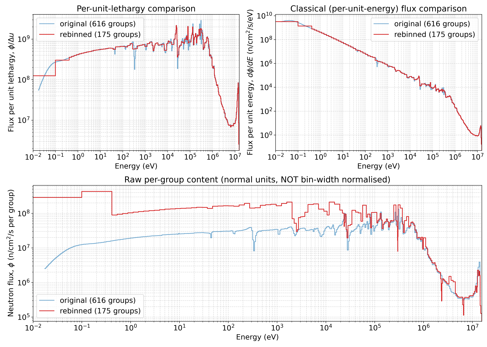{: style="display:block;margin:0 auto;width:100%;max-width:100%" }

Three panels, same two curves. Blue is the 616-group file. Red is the 175-group result. The per-group panel is on its own row, because that is the quantity the rest of the pipeline uses.

- **Top left.** Flux per unit lethargy. The two curves follow each other. The blue line is spikier, because many of those groups are very narrow. The red line averages them.
- **Top right.** Flux per unit energy. This is the check that the move did not invent or lose neutrons. The two lines sit on top of each other.
- **Bottom.** Neutrons per group. The red steps are much taller at low energy. A VITAMIN-J group is wider, so it holds more neutrons. This panel only shows how many neutrons sit in each group.

Groups that are exactly zero are dropped.

### Materials

The library is in [`config_materials.py`](../scripts/config_materials.md). Compositions come from the PNNL compendium [[2]](#ref-2). Prices are dollars per kilogram, mostly from the USGS Mineral Commodity Summaries [[3]](#ref-3).

I picked these materials because they make sense for a bench. Most of them change a neutron spectrum in a useful way. They are also practical: machinable, easy to buy, or already used in the field.

This step does not pick a stack. The optimizer does that later, from a subset of this library.

### Detector

The detector in this example is a bare air sphere, 4 cm across. That sphere is the tallied volume.

The energy response is an 18-point table, from 0.02 eV to 18 MeV. I made these numbers up. They are not the response of a real instrument. They are only here so you can see how the framework takes a response curve, fits it, and uses it later. Swap in your own table if and when you have one.

Running the file fits a curve through those points and draws it on the working grid:

```bash
python src/config_detector.py
```

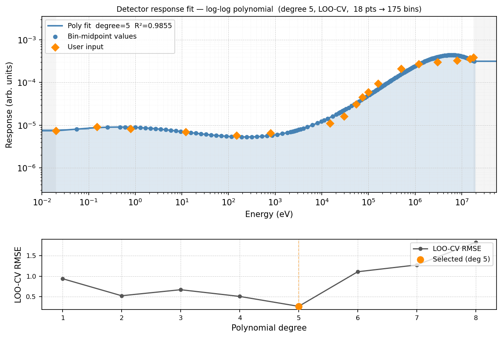{: style="display:block;margin:0 auto;width:40rem;max-width:100%" }

**Top.** Orange diamonds are the 18 made-up numbers. The blue curve is the fit, and the blue dots are that fit at the middle of each VITAMIN-J group. The pale bands at the two ends are outside the orange points. There the curve is only extended, with no point to hold it.

**Bottom.** Each point is the error of a polynomial of that degree, tested by leaving one input point out at a time. Degree 5 is the lowest. From degree 6 upward the error grows, so a wigglier curve would do worse.

### Weights

`WEIGHT_MODE` in `config.py` is `"ICRP"`. The coefficient is ambient dose equivalent H\*(10), from ICRP 74.

```bash
python src/bin_weights.py
```

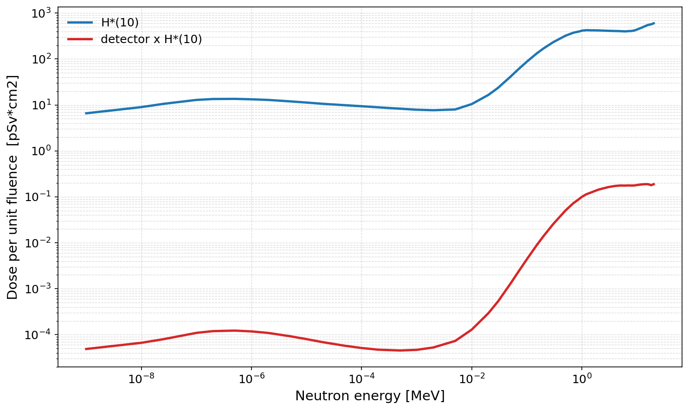{: style="display:block;margin:0 auto;width:40rem;max-width:100%" }

H\*(10) is the dose per neutron. The red curve is that coefficient times the made-up detector response. It climbs in the same place, and it sits much lower, because those made up response numbers are small. 

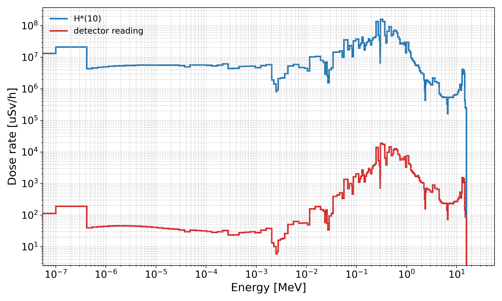{: style="display:block;margin:0 auto;width:40rem;max-width:100%" }

This is the coefficient times the vessel spectrum, one step per energy group.

- Both curves peak between about 0.1 and 1 MeV. That is the band the match will care about most.
- Above 10 MeV both curves drop away. There is little flux left up there, so the generator peak carries little of the dose.
- The blue curve is the true dose. That is what `ICRP` weights. The red curve is what a detector with this made-up response would report, which is what `dose` would weight.
- The shapes agree on where the peak is.

I keep `ICRP`. The weights then follow the true dose of the vessel spectrum.

## Transfer tensors

The optimizer does not run OpenMC for every plate stack. It reuses a database: for each material and each thickness, what comes out of a slab when a beam goes in. [`transfer_matrix.py`](../scripts/transfer_matrix.md) builds that database. It is a slow step. Rebuild it only if the energy grid, the source, the material list, or the thicknesses change.

The sketch below is the geometry of one run. A beam enters the slab from the left. Neutrons that leave the entrance face are lost. The tally is the current that exits on the right, split by outgoing angle. One run is one incoming direction and one incoming energy. The file stores all of those runs for one material and one thickness.

{: style="display:block;margin:0 auto;width:36rem;max-width:100%" }

| Setting | Value in this example | Why |
|---|---|---|
| `MATERIALS` | 20 materials from the material library [defined before](#materials) | These are the ones the optimizer is allowed to use later |
| `THICKNESSES` | 0.2, 0.8, 3, 10, 28, 75, 130 cm | Thin sheet up to a thick block, spaced so each they are evenly spaced in log space |
| `N_MU` | 5 | Five forward directions |

```bash
python src/transfer_matrix.py
```

The files land in `opt_database/`, two per material and thickness: `sn_tensor_{material}_{thickness}cm.npy` and the same name with `_std`. The first is the result. The second is the Monte Carlo uncertainty. The physics is on the [transfer-operator page](../theory/sn_transfer_operator.md).

!!! tip "Do this once"
    A full grid takes hours. After it exists, the optimizer only reads the files.

## Optimize

[`optimizer.py`](../scripts/optimizer.md) searches plate stacks. It does not run OpenMC. Each candidate is a product of the tensors from the last step. Two things are scored at once: how close the spectrum is, and how much the plates cost. The result is a front of good compromises, not one winner.

The detector here is a bare sphere, so nothing is added behind the stack. If a trial picks water, a 1 cm aluminium wall (`Al_6061`) is put on each face of that layer. Those walls are not chosen by the search. They do count in the cost and in the thickness limit.

| Setting | Value in this example | Why |
|---|---|---|
| `MATERIALS` | The same 20 as the tensor database | A name with no tensor file cannot be searched |
| `max_total_thickness` | 160 cm | Soft cap on the whole stack. A thicker trial is kept, but down-weighted |
| `max_layers` | 9 | Hard cap. The search never proposes more plates |
| `max_thickness_per_layer` | 130 cm | Hard cap |
| `MIN_THICKNESS`, `THICKNESS_STEP` | 0.2 cm, 0.1 cm | Thinnest plate, and the step every thickness is snapped to |
| `ERROR_REF`, `COST_REF` | 0.3 and 2 USD/cm$^2$ | Puts a decent match and a modest cost on the same scale |
| `N_RESTARTS` | 42 | Independent searches because the solution landscape cna have multiple local optima, different seeds |
| `N_TRIALS_EACH`, `PATIENCE` | 4400, stop after 400 trials with no improvement | Ideally, a restart should stop because the front stalled, not because it hit the cap |

```bash
python src/optimizer.py
```

Two figures are written next to the script.

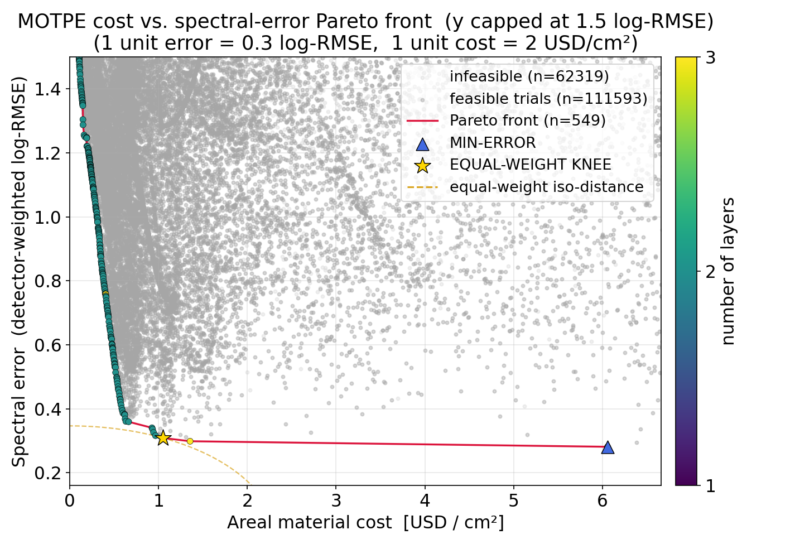{: style="display:block;margin:0 auto;width:44rem;max-width:100%" }

Horizontal is cost. Vertical is spectral error. Lower is a closer spectrum. The cloud is every trial. Paler dots are trial that violated the soft constraint. The red line is the front: on that line, a cheaper stack is a worse match, and a closer match costs more. The colour of those dots is the number of plates.

The line drops fast, then goes flat near an error of about 0.3. Past that bend, more money barely helps. The gold star is that bend. The blue triangle is the smallest error, far to the right, for almost the same match and several times the cost. The dashed gold curve is the equal-weight contour through the star. The vertical axis stops at 1.5 so the front stays readable. Trials worse than that are off the top.

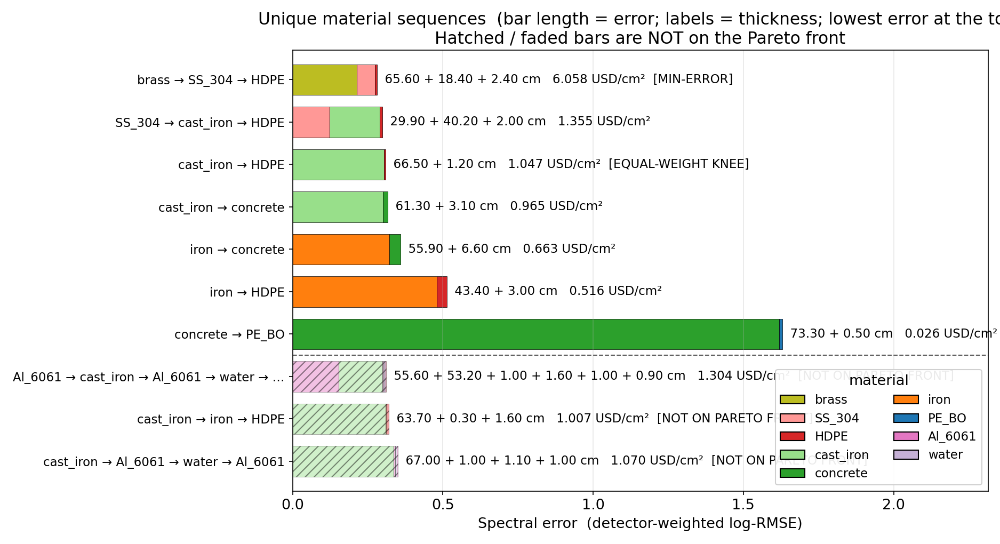{: style="display:block;margin:0 auto;width:100%;max-width:100%" }

Each row is one material order. The bar length is the error again, so a shorter bar is a closer spectrum. The colours are the materials, and the text gives the thicknesses and the cost. The arrangement with the lowest error is at the top.

The star from the first figure is the row `cast_iron → HDPE`: a thick iron plate and a thin polyethylene sheet, about 1 USD/cm$^2$. The blue triangle is the top row, brass then steel then polyethylene, about 6 USD/cm$^2$, for a slightly shorter bar. The long dark bar is a very cheap concrete stack. It is on the front, and the match is much worse. Hatched bars under the dashed line showed up often in the search. They are not on the front.

I choose to test the gold star proposed arrangement. The extra money for the smallest error does not buy a meaningful closer spectrum. One stack from this list is what the next scripts calibrate. The full knob list is on the [optimizer page](../scripts/optimizer.md).

!!! tip "Reprint without searching again"
    [`read_opt.py`](../scripts/read_opt.md) reloads `study_results_multistart.pkl` and redraws these two figures.

## Validate

[`base_plates.py`](../scripts/base_plates.md) is the forward model. Later scripts ask it for a spectrum. Up to here the plates were infinite slabs. This is the 3-D check of the one stack I kept: the plates are finite and the tally is the same 4 cm air sphere.

I keep this geometry very simple on purpose. Flat plates, one material each, a bare detector. It can be made much more complicated when a real bench needs that: a different shape, more parts, a real instrument body, the room where the experiment is going to be performed. The method still works. Dataset and calibration only need the spectrum back on the same energy grid. The full rule is on the [base plates page](../scripts/base_plates.md).

I set the equal-weight knee (gold star from before) arrangement and thicknesses into the file. Cast iron first, then a thin sheet of HDPE.

| Setting | Value in this example | Why |
|---|---|---|
| `MATERIALS` | `cast_iron`, `HDPE` | The equal-weight knee arrangement from the last step |
| `THICKNESSES` | 66.50 cm, 1.20 cm | Thick iron, then the polyethylene sheet as suggested by the last step |
| `PLATE_DIM` | 30 cm | Square side of the finite plates |
| `X_START` | 0.1 cm | Gap from the point source to the first face |
| `CE_BATCHES`, `CE_PARTICLES` | 100, 150 000 | So the uncertainty band on the spectrum stays thin |
| `PLOT_WW_BIN` | 5 | Draw one weight-window group that is plotted |
| `SOURCE_STRENGTH` | `5e9` | Neutrons per second emitted by the neutron generator. It only scales the real-units figure |

Angle bias is on (`USE_ANGLE_BIAS = True`). The point source prefers directions that hit the plates. The mesh, the ray count, and the thread counts are on the [base plates page](../scripts/base_plates.md).

The run has two phases. Phase 1 builds weight windows (FW-CADIS). A source is placed in the detector and run backwards, and neutrons that head toward it are split, so the tally is quieter. The windows change the sampling. The physics stays the same. The group strengths follow `WEIGHT_MODE`, which is `ICRP`. Phase 2 is the continuous-energy tally that uses the windows.

```bash
python src/base_plates.py
```

Four figures. Geometry first, then the two spectrum comparisons, then the weight-window map. The terminal also prints a bin table and one line, `Weighted Log-RMSE = ...`. That number is calculated in the way as the optimizer but now on this 3-D geometry.

### Geometry

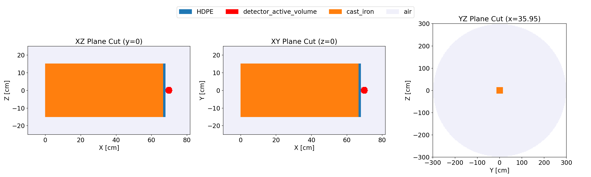{: style="display:block;margin:0 auto;width:100%;max-width:100%" }

Three cuts of the same model. The legend is the materials. Red is the tally volume, the bare air sphere. Pale is the air around the experiment.

- **Left and middle.** Side view and top view, zoomed on the plates. The long orange block is the 66.50 cm of cast iron. The dark blue line on its right face is the 1.20 cm of HDPE. The red dot just after that line is the 4 cm detector. The source is a point at \(x = 0\), 0.1 cm before the iron.
- **Right.** A cut at \(x = 35.95\) cm, inside the iron. The view is the whole air sphere, 300 cm in radius, so the 30 cm plate is a small square in the middle. HDPE and the detector are downstream of this plane.

### Spectrum

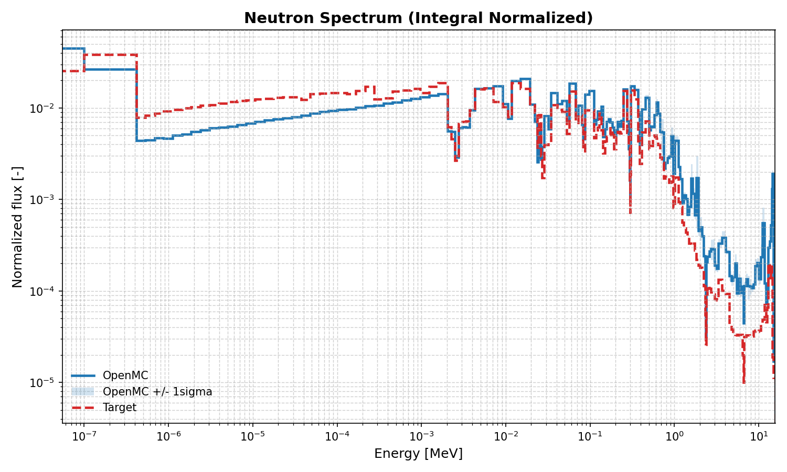{: style="display:block;margin:0 auto;width:44rem;max-width:100%" }

Both curves are normalised so the groups sum to one. Blue is OpenMC. The pale band is its Monte Carlo uncertainty, one standard deviation. The red dashed line is the vessel target. Groups where the target is exactly zero are left off. Both axes are logarithmic.

I continue with this geometry. The shape is already almost there, and the two curves agree in general. That looks promising enough.

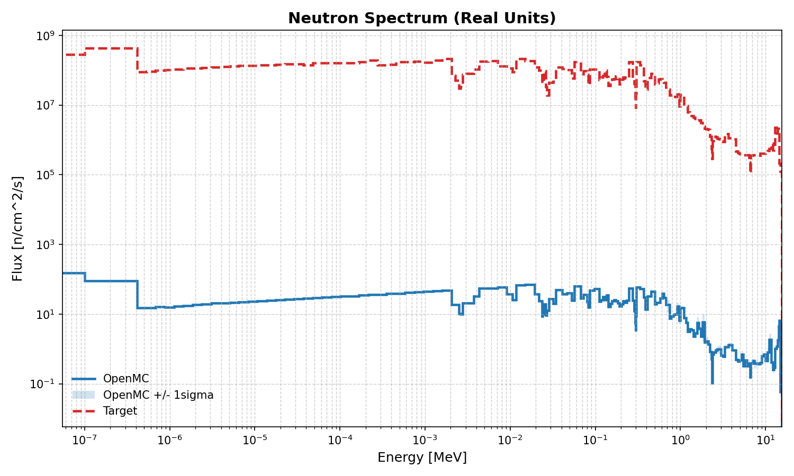{: style="display:block;margin:0 auto;width:44rem;max-width:100%" }

Same energy axis, same two curves. The vertical axis is now neutrons per square centimetre per second. The blue curve is the OpenMC tally times `SOURCE_STRENGTH` (`5e9` neutrons per second), divided by the detector volume. The red curve is the stored target, still in neutrons per group.

!!! warning "Absolute flux is out of reach (in this example)"
    The red curve sits near the top of the axes and the blue curve sits near the bottom. That offset is expected. The vessel flux peaks near \(10^{9}\) neutrons per square centimeter per second. A portable neutron generator emits at most about \(10^{10}\) neutrons per second, and this bench is already set near that, at `5e9`. An absolute calibration is of real interest. For this spectrum and this source, it is out of reach. Judge the shape on the normalised figure above.

### Weight windows

Phase 1 writes `ww_generation/weight_windows.h5`. Eleven energy groups are stored. `PLOT_WW_BIN = 5`, so the drawn file is `ww_bounds_bin_5.png`.

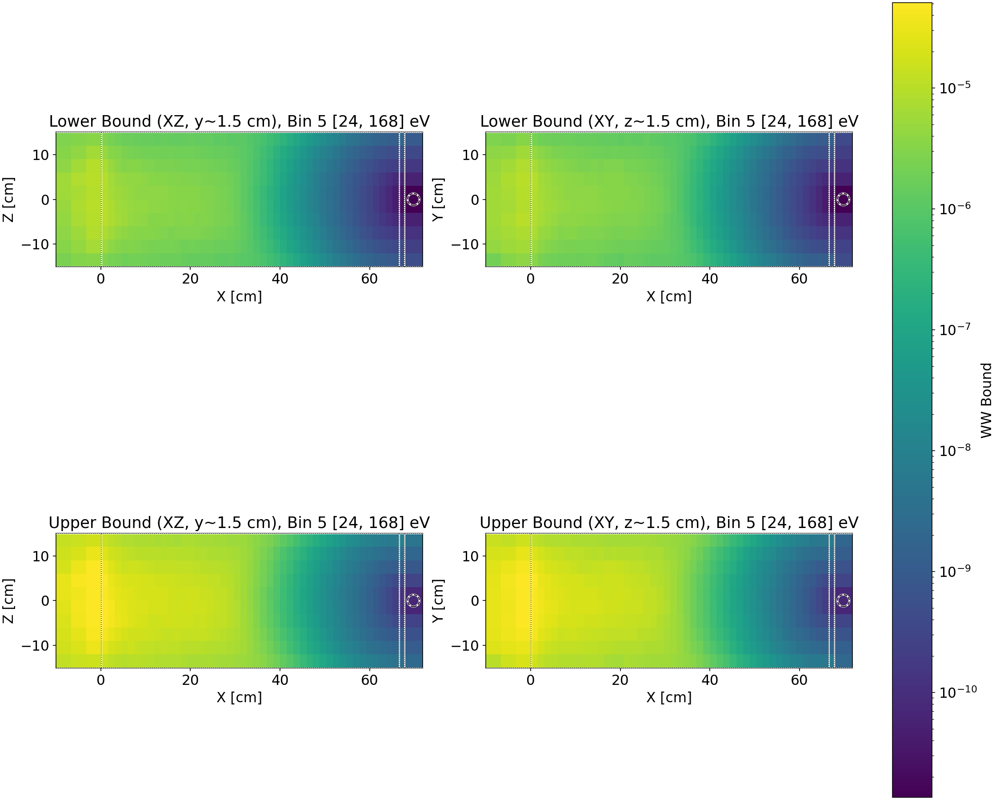{: style="display:block;margin:0 auto;width:100%;max-width:100%" }

Four panels, one group. The top row are the lower bounds of the window. The bottom row are the uppper bounds. The left column is a side cut. The right column is a top cut.

The colour goes from yellow at the source, on the left, to purple at the detector, on the right. Neutrons that have crossed the iron are split, which is what the windows are for. The white lines are the plate faces. The dotted circle at the right is the detector. The map is smooth, so the windows are usable.

Phase 2 writes the statepoint in `ce_run/`. That folder has no plot of its own.

!!! tip "Drop a bad stack here"
    Dataset and calibration call this same model. If the normalised spectrum is still far from the target at a larger `PLATE_DIM`, the materials are the problem. Fix that here, before spending a dataset on the stack.

## Dataset

The training set for this example is already in the repository, at `examples/demo_hcpb_vv.csv`. The check and the calibration below read that file, so you can follow them without running the OpenMC sweep.

[`dataset_creation.py`](../scripts/dataset_creation.md) is what filled that table. The materials stay the stack I just kept: cast iron, then HDPE. Four numbers move: the gap, the iron thickness, the HDPE thickness, and the plate size \(L\). Each row is one run of the same forward model. The settings below are the ones that produced the given CSV, if you want to rebuild it.

| Setting | Value in this example | Why |
|---|---|---|
| `MATERIALS` | `cast_iron`, `HDPE` | Same order as the 3-D check |
| `X_START_BOUNDS` | 0.1 cm to 5 cm | The check used a 0.1 cm gap. Here the gap can move |
| `THICKNESS_BOUNDS` | iron 30–95 cm, HDPE 0.1–20 cm | A box around the 66.50 cm and 1.20 cm of the check |
| `L_BOUNDS` | 25 cm to 90 cm | Square plate side. The check was 30 cm |
| `N_SAMPLES` | 350 | How many new points this run asks for |
| `SOBOL_SEED` | 42 | Same seed, same points, same order |
| `CE_BATCHES`, `CE_PARTICLES` | 100, 200 000 | Particles and batches of Phase 2, choosen to give a low uncertainty along the whole spectrum while still being computationally affordable |
| `OUTPUT_CSV` | `examples/demo_hcpb_vv.csv` | Already included. The calibration reads this file |

The points are a Sobol sequence. The count, the seed, and what `--refine` does are on the [dataset page](../scripts/dataset_creation.md).

```bash
python src/dataset_creation.py
```

The script asks for 350 points. A sample that (eventually) fails is left out of the file, and the next success keeps the next index, so a failure shows up as a hole.

### A check on the CSV

[`analize_dataset.py`](../scripts/analize_dataset.md) is optional. It only reads the CSV and draws. I run it before the fit. It answers two questions: how many samples are quiet enough in each energy group, and which transform makes those fluxes look more like a gaussian curve.

```bash
python src/analize_dataset.py
```

`CSV_PATH` points at `../examples/demo_hcpb_vv.csv` (the training set in `examples/`). The script writes seven figures next to that file. Two of them are below.

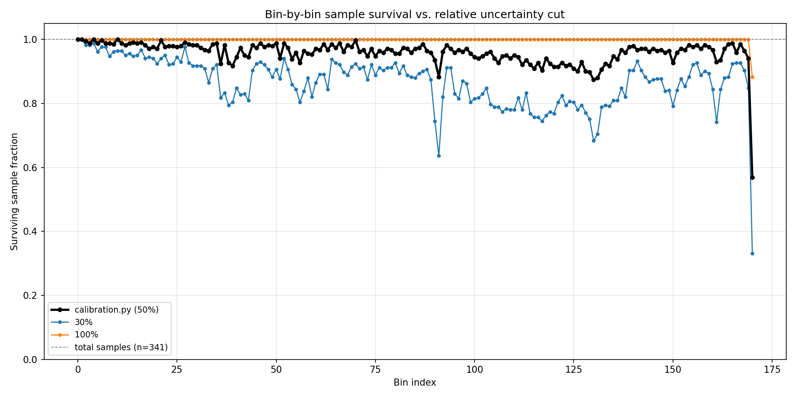{: style="display:block;margin:0 auto;width:44rem;max-width:100%" }

Horizontal is the energy-bin index. Vertical is the fraction of the 341 samples whose relative uncertainty stays under the cut. The grey dashed line is every sample.

- **Black.** The cut in `calibration.py`, 50%. It stays near the top for most bins and falls on the last bins, the fast end of the grid.
- **Blue.** A tighter cut, 30%. Same shape, lower. The last bins fall further.
- **Orange.** A loose cut, 100%. It sits on the top line until that same last drop.

At the 50% cut, most bins keep most of their samples. The last bins are the noisy ones.

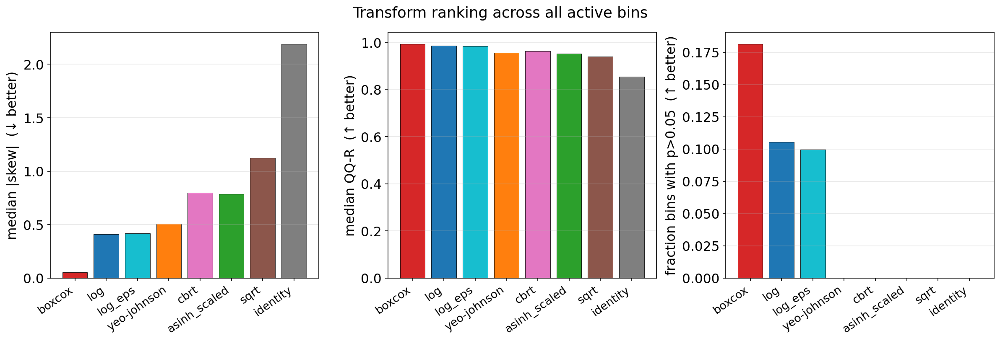{: style="display:block;margin:0 auto;width:100%;max-width:100%" }

Three scores. Lower skew is better. Higher QQ correlation is better. The right-hand panel is the fraction of bins that pass a normality check.

- **Left.** Box–Cox is the short red bar. The raw flux, `identity`, is the tall grey bar.
- **Middle.** Box–Cox, log, and Yeo–Johnson all sit near 1. The raw flux is the lowest.
- **Right.** Box–Cox is the tall bar. Log is next. Several transforms do not clear the check in any bin.

I choose Box–Cox. It is the clear winner, and I set that choice in the next script.

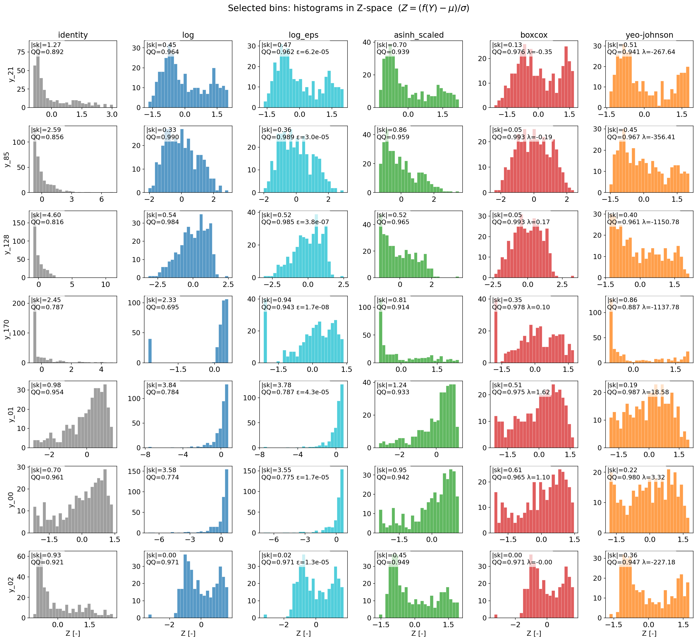{: style="display:block;margin:0 auto;width:100%;max-width:100%" }

Each row is one energy bin. Each column is one transform. A bell shape is what the fit wants. The grey column, the raw flux, is a spike against one side. The red column, Box–Cox, is the closest to a bell. A few rows stay lumpy for every transform.

The script writes several more figures. I leave them out of this page for brevity.

## Calibrate

[`calibration.py`](../scripts/calibration.md) is the last step. It learns the CSV, then it finds the gap, the two thicknesses, and the plate size that bring the bench close to the vessel spectrum. The materials stay cast iron, then HDPE. One OpenMC run at the end checks that answer. The full knob list is on the [calibration page](../scripts/calibration.md). The sampling is on the [theory page](../theory/bayesian_calibration.md).

| Setting | Value in this example | Why |
|---|---|---|
| `CSV_PATH` | `examples/demo_hcpb_vv.csv` | The CSV from the last step |
| `Y_TRANSFORM` | `"boxcox"` | The transform I decided to with after the ranking figure |
| `UNC_LIMIT` | 0.50 | A row noisier than 50% is left out of that bin |
| `MATERN_NU` | 0.5 | One rough Gaussian process per energy bin |
| `USE_MC_NOISE` | `True` | The Monte Carlo error on each row is included in the fit |
| `LIKELIHOOD_SIGMA_PCT` | 10 | How far a bin may sit from the target |
| Sampler | SMC | The call that runs. NUTS is in the file, commented out |
| `SAMPLING_DRAWS`, `SAMPLING_CHAINS` | 700, 8 | Particles kept per chain, and eight chains |
| `PP_CRED` | 94 | Width of the band drawn later, in percent |
| `VAL_CE_BATCHES`, `VAL_CE_PARTICLES` | 100, 200 000 | The batches and particles for OpenMC at the chosen sizes |
| `WW_PARTICLES` | 60 000 | Rays that build the weight windows for that tally |

```bash
python src/calibration.py
```

### Surrogate

Four inputs: the gap `x1`, the iron thickness `t1`, the HDPE thickness `t2`, and the plate side `L`. The fit uses 272 of the 350 rows. The other are the hold-out.

Four target groups are empty, `y_171` through `y_174`, so they are skipped. That leaves 171 bins. No row had a negative flux. One bin is noisy: at the 50% cut, `y_170` keeps 56.9% of its rows, under the 70% warning.
 
Two bins were switched to logarithm transform, because the fitted exponent was high and the target sat in the low tail of the training rows: `y_00` (1.119 → 0) and `y_01` (1.623 → 0).

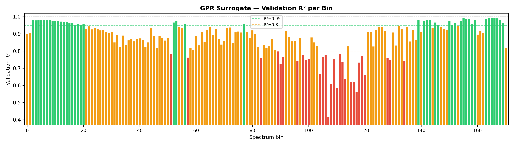{: style="display:block;margin:0 auto;width:100%;max-width:100%" }

Each bar is one bin, scored on the hold-out rows that passed the 50% cut. Green is 0.95 or better. Orange goes down to 0.80. Red is under 0.80.

- The red bars sit in the middle. There are 29 of them. The shortest is `y_107`, at 0.4188.
- 45 bins are at or above 0.95. 142 are at or above 0.80. The mean is 0.8807.
- No bin fell back to a constant.

A high score in the transformed space with a low score on this figure means the step back to flux stretched a tail error.

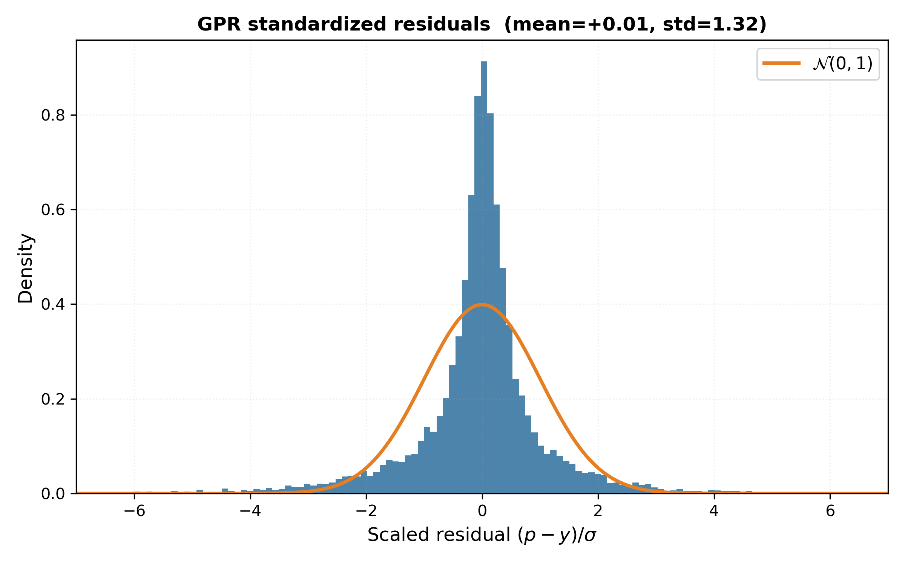{: style="display:block;margin:0 auto;width:40rem;max-width:100%" }

Each hold-out miss is divided by the uncertainty the process quoted. An honest (ideal) band looks like the orange curve: mean 0, spread 1, and about 95.4% of the misses inside +/-2.

- The mean is +0.012.
- The spread is 1.317. Above 1, so the quoted uncertainty is underestimated.
- 90.7% of the misses sit inside +/-2.

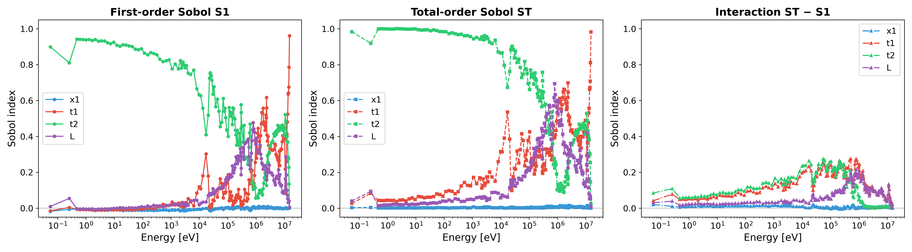{: style="display:block;margin:0 auto;width:100%;max-width:100%" }

Three panels, same four inputs. Blue is the gap `x1`. Red is the iron `t1`. Green is the HDPE `t2`. Purple is the plate side `L`.

- **Left.** What each input does on its own. Green owns the low energy. Red climbs and owns the fast end. Purple joins from about 10 keV upward. Blue stays on the floor. That is expected. The source gap barely changes the spectrum, so the match does not care where the source sits inside this range.
- **Middle.** Fraction of variance explained by each input, including interactions with other inputs. Green sits even closer to 1 at low energy.
- **Right.** Difference between the left and middle figure for each parameter. The closer to 0 the more an input acts (almost) independently of other parameters.

The script also writes `gpr_scatter_per_bin.png`, one panel per bin, and `gpr_spectrum_examples.png`, six hold-out spectra. I leave those two out of this page.

### Posterior

The sampler is SMC. Eight chains. The log ends at stage 11 with beta equal to 1, which is the posterior itself. \(\hat{R}\) is 1.0 on every parameter, and the effective sample size is about 5 400 to 5 700.

The gap does not move the spectrum, so I show the corner plot with `x1` left off. The script also writes `calibration_pair_plot.png`, with the gap included. I leave that one out.

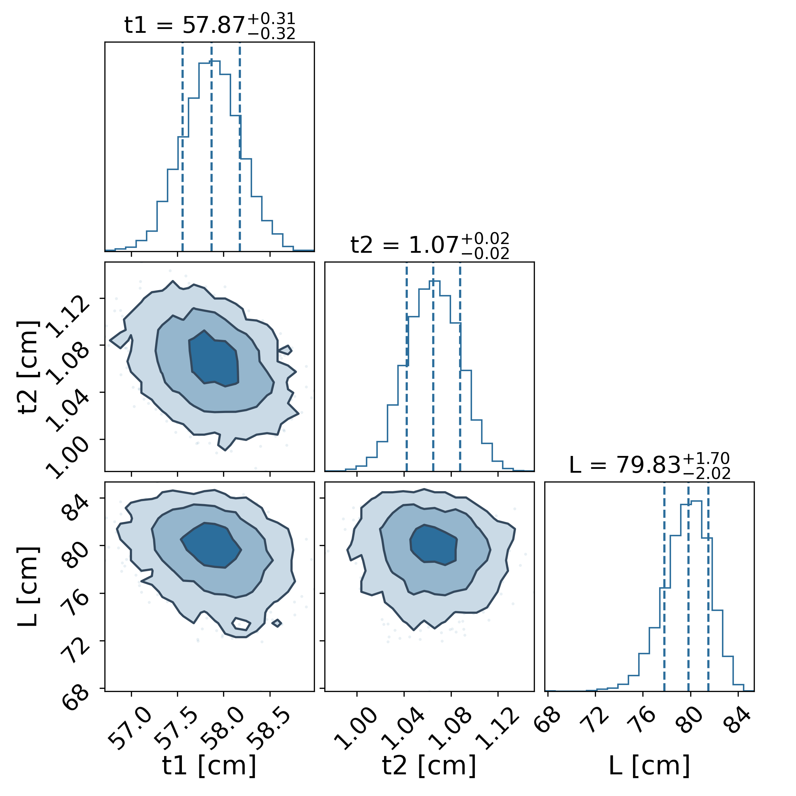{: style="display:block;margin:0 auto;width:36rem;max-width:100%" }

Each title is the size to order, then a + and a −. The program tried many sizes and kept the ones whose spectrum stayed within the 10% miss (`LIKELIHOOD_SIGMA_PCT`). The plot is that pile. The middle number is the typical size in the pile. The +/- is how wide the fat part of the pile is. They come out of the 10%.

Treat the +/- as the shop aim. Order the middle number. Ask the shop to stay inside the +/-. Inside it, the program kept that size often. A bit outside, it kept that size less often. The spectrum does not flip at the edge, and a size inside the +/- is not a promise that every bin is within 10%.

| Size | Order | Shop aim | On the bench |
|---|---|---|---|
| Iron `t1` | 57.87 cm | +0.31 cm, −0.32 cm | About 3 mm on a 58 cm plate |
| HDPE `t2` | 1.07 cm | +0.02 cm, −0.02 cm | 0.2 mm |
| Plate side `L` | 79.83 cm | +1.70 cm, −2.02 cm | About 2 cm on an 80 cm square |

The gap is missing from the figure on purpose. Its pile runs from 2.080 cm to 3.714 cm. Any source position in that span is fine.

I keep the draw with the smallest $\chi^2$ in the transformed space:

`x1` = 2.86 cm, `t1` = 57.78 cm, `t2` = 1.07 cm, `L` = 80.50 cm.

$\chi^2$ is 719.96. The reduced $\chi^2$ is 4.21, over 171 bins. A value near 1 (ideal) would mean the misses line up with the 10% tolerance. The mean log-relative error of the same draw is 22.40%, and that number is only a reading. The choice used the $\chi^2$.

The script also writes `calibration_trace_plot.png` and `calibration_posterior_correlation.png`. I leave them out.

!!! tip "NUTS is the other sampler"
    SMC is the call that ran. It settles on one geometry, which is the single peak on the corner plot. NUTS is the commented call in the file. Uncomment it when you want the chains to look for more than one design. for more details see [calibration page](../scripts/calibration.md#sampling).

### One OpenMC check

The band below is the surrogate, over every posterior draw and over the surrogate's own uncertainty.

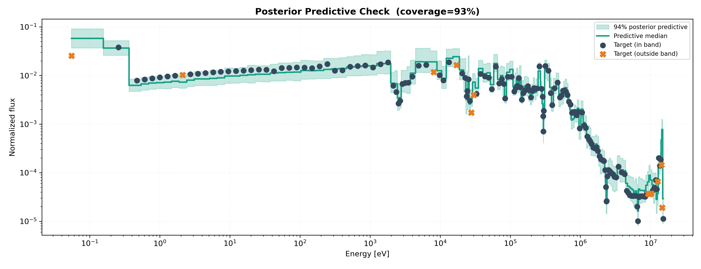{: style="display:block;margin:0 auto;width:100%;max-width:100%" }

The green line is the median. The pale band is the central 94%. Dark dots are target bins inside the band. Orange crosses are outside it.

159 of 171 bins are inside, 93.0%. 

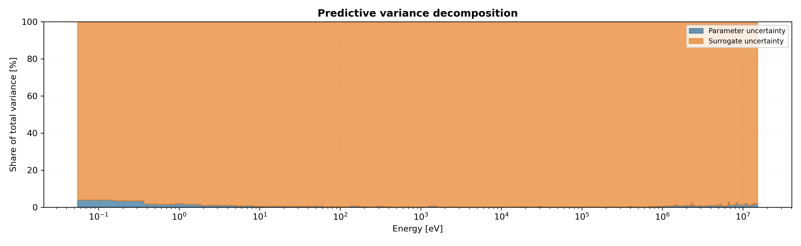{: style="display:block;margin:0 auto;width:100%;max-width:100%" }

Orange is the surrogate. Blue is the uncertainty in the four sizes. The orange fill covers the bar (ideal case, it means the sampling converged correctly). The surrogate share averages 99.3%, from 96.1% to 99.9%. The pale green band on the figure above is almost all emulator error.

!!! info "More OpenMC runs shrink this band"
    The blue piece is already thin. More OpenMC runs (rows) in the CSV would tighten the band. A longer chain would leave it where it is.

The draw I kept is then one OpenMC run, the same two phases as [`base_plates.py`](../scripts/base_plates.md). The plate faces land at 2.86 cm, 60.65 cm, and 61.71 cm. `L` is 80.50 cm.

This run writes no geometry figure. The plates are still cast iron, then HDPE.

Phase 1 writes `val_ww/weight_windows.h5`.

Phase 2 writes `val_ce/statepoint.100.h5`.

The run also writes `neutron_spectrum_log_log.png` and `neutron_spectrum_real_log_log.png`, the same kind of plot as in the validate step, now at these sizes. I leave those two out for brevity.

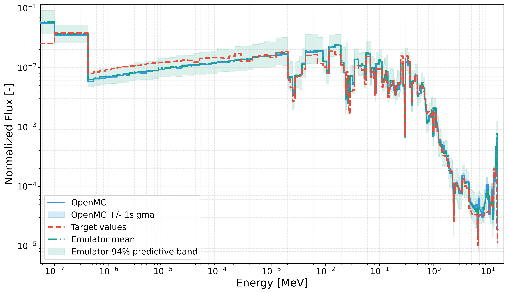{: style="display:block;margin:0 auto;width:44rem;max-width:100%" }

Three curves. Blue is OpenMC, with its one-standard-deviation band. Green is the emulator: the curve is the median of the predictive band. The pale green band is that 94% band. Red is the target.

- Green sits on blue along the grid. The surrogate and the foward model agree.
- The pale green band covers the red line through most groups. A few groups step outside it, including the first.

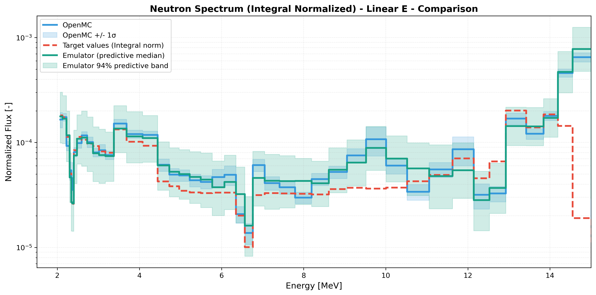{: style="display:block;margin:0 auto;width:44rem;max-width:100%" }

Same three curves, from about 2 MeV to 15 MeV.

- Blue and green stay together.
- In the last groups the red target drops, while the blue and green lines stay higher.

## Conclusion

The proposed bench experiment uses peak 14.8 MeV source, a gap, a thick cast-iron plate, and a thin HDPE sheet. The detector sits on the far face of the HDPE. The gap can be anywhere from 2.08 cm to 3.71 cm. Order the iron at 57.87 cm, the HDPE at 1.07 cm, and a square plate of 79.83 cm. Hold the HDPE to 0.2 mm. The iron can miss by about 3 mm, and the square by about 2 cm.

The spectrum follows the vessel target. On the comparison figure the tally, the surrogate, and the target sit together across the grid. 159 of the 171 bins fall inside the 94% band.

Cast iron and HDPE are ordinary materials. They are decently easy to buy and to machine. This pair is the cheap bend of the front, about 1 USD/cm$^2$. The closest spectrum on that same front was about 6 USD/cm$^2$, for a match that was only a little better.

## References

- <a id="ref-1"></a>[1] P. Batistoni et al., *Technical preparations for the in-vessel 14 MeV neutron calibration at JET*, Fusion Engineering and Design 117 (2017) 107–114. [doi:10.1016/j.fusengdes.2017.01.023](https://doi.org/10.1016/j.fusengdes.2017.01.023)
- <a id="ref-2"></a>[2] R. S. Detwiler, R. J. McConn, T. F. Grimes, S. A. Upton, and E. J. Engel, *Compendium of Material Composition Data for Radiation Transport Modeling*, PNNL-15870, Rev. 2, Pacific Northwest National Laboratory, April 2021. [available here](https://mcnp.lanl.gov/pdf_files/TechReport_2021_PNNL_PNNL-15870Rev.2_DetwilerMcConnEtAl.pdf)
- <a id="ref-3"></a>[3] U.S. Geological Survey , *Mineral Commodity Summaries*. [usgs.gov](https://www.usgs.gov/centers/national-minerals-information-center/mineral-commodity-summaries)
- FISPACT-II reference input spectra, UKAEA. DEMO-HCPB-VV: neutron spectrum in the vacuum vessel of the DEMO helium-cooled pebble-bed concept. [fispact.ukaea.uk](https://fispact.ukaea.uk/wiki/Reference_input_spectra)
