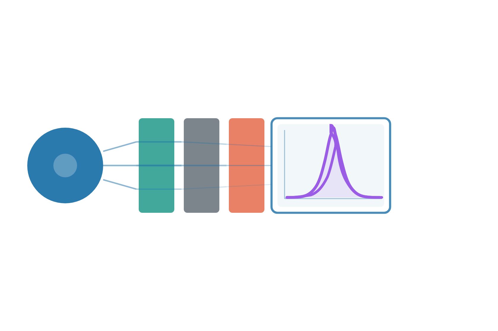

# Neutron Spectrum Matching via Bayesian Inference

<div style="display: flex; justify-content: center;">
  <div style="background-color: white; padding: 20px;">
    
  </div>
</div>

This framework designs a neutron detector calibration bench. You give it a source and the spectrum a detector should see. It returns the shielding in between: which materials, in which order, how thick, and how large the plates should be. Each size comes with a range, so you can see what the shop must hold tightly and what can still move.

!!! warning "Shape only"
    Spectra are compared after normalisation. The match is the shape.

Transport uses the Python API of [OpenMC](https://openmc.org). The computational expensive steps have been made HPC compatible.

---

## Start here

Read the [DEMO vacuum-vessel example](example/demo_vv.md) first. It is one full run: the open FISPACT-II spectrum **DEMO-HCPB-VV**, a compact DT source, the figures at each stage, and the choice that were made. Parameter lists stay on the script pages, linked from there.

The other tabs are the reference:

| Tab | Use it when you need |
|---|---|
| [Pipeline](scripts/config.md) | Every setting, one script at a time |
| [Theory](theory/sn_transfer_operator.md) | The transfer operator, the optimizer, and the bayesian calibration |

---

## The pipeline

Six stages, in the order you run them. The names are the sections of the Pipeline tab.

| Stage | What you run | What you decide |
|---|---|---|
| [Configure](scripts/config.md) | `config.py`, `config_materials.py`, `config_detector.py` | Source, target spectrum, materials, detector. If the published grid is not the working grid, [rebin](scripts/rebin_target_spectrum.md) first. [Plot the weights](scripts/bin_weights.md) before choosing `WEIGHT_MODE`. |
| [Transfer tensors](scripts/transfer_matrix.md) | `transfer_matrix.py` | A slab database, built once. The optimizer reads those files. |
| [Optimize](scripts/optimizer.md) | `optimizer.py` | Material order and a first thickness, scored on spectrum and cost. The result is a front of compromises. Pick one material arrangement. |
| [Validate](scripts/base_plates.md) | `base_plates.py` | One 3-D run of that material order. If the shape is still far from the target, change the stack here. |
| [Dataset](scripts/dataset_creation.md) | `dataset_creation.py` | Many runs of the same stack. The gap, the thicknesses, and the plate size vary. |
| [Calibrate](scripts/calibration.md) | `calibration.py` | A surrogate of those runs, the posterior over the sizes, and one OpenMC check of the sizes you keep. |

Two helpers sit beside that path. [`read_opt.py`](scripts/read_opt.md) redraws the optimizer figures. [`analize_dataset.py`](scripts/analize_dataset.md) inspects the CSV before the fit.

`HPC` on or off is a switch at the top of each computationally expensive script.

Scripts live in `src/`. A typical call is `python src/optimizer.py`.

---

## Install

1. **OpenMC, develop branch.** Follow the [install guide](https://docs.openmc.org/en/develop/usersguide/install.html).
2. **Nuclear data**, downloaded separately from the [OpenMC data repository](https://openmc.org/data/). ENDF/B-VIII.0 HDF5 is the usual choice. Point `config.py` at the library you actually have.
3. **Python packages**, ideally inside a virtual environment:

```bash
pip install -r requirements.txt
```

---

## Future work

The same method can also be applied to gamma calibration. That still needs work, and it may be developed and included later.

---

## Acknowledgements

This work is part of a master’s thesis on experiment design for neutron detector calibration. The internship was partially funded by the **FuseNet Association**, with partial support from the **EUROfusion Consortium**.
