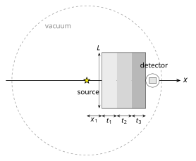

# `base_plates.py` — OpenMC Forward Model

## Purpose

`base_plates.py` is the OpenMC model of the real experiment geometry: a finite N-layer plate stack, the detector body from [`config_detector.py`](config_detector.md), and a point source at the origin.

The optimizer sees infinite slabs. This script is the first place those candidate recipes are checked in 3-D, with transverse leakage and the actual detector. Run it on the tagged sequences from [`optimizer.py`](optimizer.md) **before** spending a Sobol dataset on an arrangement.

It also owns the two-phase FW-CADIS local variance reduction (developed by Jack Fletcher @MIT-PSFC) workflow that [`dataset_creation.py`](dataset_creation.md) and the MAP check in [`calibration.py`](calibration.md) call.

Phase 1 builds weight windows from a **local adjoint source in the detector**, not from a forward-weighted \(1/\phi\) target tally. Group strengths follow [`WEIGHT_MODE`](config.md#per-bin-weighting) in `config.py`. Phase 2 is the continuous-energy production run that tallies the spectrum.

!!! info "Forward model compatibility"
    Any forward model that writes a multigroup flux tally compatible with `dataset_creation.py` and `calibration.py` can replace this geometry. Swap plates, materials, detector, energy grid, or the variance-reduction scheme (or drop it) without touching the rest of the pipeline, as long as `extract_flux` still returns an integral-normalised spectrum on `TARGET_ENERGY_EDGES`.

---

## Contents

| Section | Variables |
|---|---|
| [Checking an optimizer candidate](#checking-an-optimizer-candidate) | `MATERIALS`, `THICKNESSES`, `PLATE_DIM` |
| [Parallelism](#parallelism) | `HPC`, `THREADS`, `MPI_TASKS_*`, `OMP_THREADS_*` |
| [Geometry](#shield-geometry) | `X_START`, `PLATE_DIM` |
| [Phase 1 (weight windows)](#mc-run-parameters--phase-1-weight-windows) | `WW_*`, `MGXS_PARTICLES`, `WW_ENERGY_EDGES` |
| [Phase 2 (CE production)](#mc-run-parameters--phase-2-ce-production) | `CE_*`, `MAX_LOWER_BOUND_RATIO`, `MAX_SPLIT`, `USE_ANGLE_BIAS` |
| [WW mesh](#weight-window-mesh) | `PLATE_*_RESOLUTION`, `AIR_CELLS`, `SOURCE_X_CELLS` |
| [Outputs](#outputs) | `PLOT_GEOMETRY`, `PLOT_WW_BIN` |

---

## Checking an optimizer candidate

The optimizer report lists unique material sequences with a merged layer recipe. Paste that recipe here:

```python
MATERIALS   = ['graphite', 'iron', 'Pb']   # keys from config_materials.py
THICKNESSES = [12.4, 8.0, 3.2]             # cm, one entry per layer
PLATE_DIM   = 60                           # square transverse size L [cm]
X_START     = 0.1                          # cm — gap from the point source to the first face
```

`MATERIALS` and `THICKNESSES` must have the same length. Names must be keys in [`config_materials.py`](config_materials.md). Layers stack along \(+X\) starting at `X_START`.

`PLATE_DIM` is the square side length \(L\) (\(Y\) and \(Z\)) of the finite plates in this 3-D check. Neutrons can stream around the edges here, and that leakage is missing from the optimizer, so a small \(L\) looks systematically worse than the 1-D prediction even when the material sequence is fine. A larger \(L\) usually helps: it is closer to the infinite-slab approximation.

This `PLATE_DIM` is a single check size, not the calibration range. The bounds on \(L\) are decided later in [`dataset_creation.py`](dataset_creation.md) (`L_BOUNDS`), which Sobol-samples \(L\) as a design variable around the regime you settle on here.

!!! tip "Which sequences to run"
    I personally suggest starting with the **EQUAL-WEIGHT KNEE** and the **MIN-ERROR** tag, then one other sequence you might actually fabricate. The point is to reject stacks that only looked good as infinite slabs, and to settle particle counts, *before* `dataset_creation.py`.
    If the 3-D spectrum is still much softer than the optimizer predicted even at a large `PLATE_DIM`, the arrangement itself is the problem, not the plate size.

---

## Parallelism

```python
HPC: bool = False   # True when submitting on a cluster
```
Both phases use OpenMP. **Phase 2 also uses MPI** by default, locally and on HPC, with `shared_secondary_bank` so ranks share the secondary-particle bank under heavy weight-window splitting.

!!! warning "MPI support needed"
    That default needs OpenMC **built with MPI**. A non-MPI install works too, but then you have to change this script a bit.

=== "Local"

    `HPC = False`

    | Constant | Default | Phase | Role |
    |---|---|---|---|
    | `THREADS` | `(os.cpu_count() // 2) - 1` | Phase 1 (random ray) | OpenMP threads; no MPI |
    | `MPI_TASKS_LOCAL` | 2 | Phase 2 (CE) | MPI ranks (`mpirun`) |
    | `OMP_THREADS_CE_LOCAL` | 4 | Phase 2 (CE) | OpenMP threads **per rank** (must be the same on every rank) |

=== "HPC"

    `HPC = True`

    | Constant | Default | Phase | Role |
    |---|---|---|---|
    | `OMP_THREADS_RR_HPC` | 192 | Phase 1 (random ray) | OpenMP threads on all cores; random-ray does not support MPI |
    | `MPI_TASKS_HPC` | 8 | Phase 2 (CE) | MPI ranks |
    | `OMP_THREADS_CE_HPC` | 24 | Phase 2 (CE) | OpenMP threads per rank |

A good rule of thumb for Phase 2 is \(\texttt{MPI_TASKS} \times \texttt{OMP_THREADS_CE} =\) the cores you are allocating. Uniform threads per rank are required by the shared secondary bank.

!!! warning "Random-ray (Phase 1) does not support MPI"
    Extra MPI ranks would sit idle. The script always launches Phase 1 as pure OpenMP, regardless of `HPC`.

!!! info "These knobs are inherited"
    `dataset_creation.py` and the MAP OpenMC run in `calibration.py` import this module and go through the same launcher. Set `HPC` and the thread/rank counts **once here**. Particle counts for the Sobol sweep live in `dataset_creation.py`. The calibration MAP check has its own particle counts as well.

---

## Geometry

```python
X_START   = 0.1    # cm — source → first plate
PLATE_DIM = 60     # cm — square plates; Y_DIM = Z_DIM = PLATE_DIM
```

{: style="display:block;margin:0 auto;width:40rem;max-width:100%" }
*Side view, not to scale. Point source at the origin; square plates of common side \(L\) and thicknesses \(t_k\) stacked along \(+x\); nested detector on the last face.*

The domain is a vacuum sphere of radius `AIR_SPHERE_RADIUS`. The last plate face plus the detector must stay inside that sphere or the model will raise errors.

The **source** is the same spectrum as the rest of the pipeline from [`config.py`](config.md). It is a point at the origin. Phase 1 (multigroup random-ray) uses a discrete line at each source-bin midpoint; Phase 2 (CE) uses a histogram density.

The **detector** is `DETECTOR_GEOMETRY` from [`config_detector.py`](config_detector.md). It sits on the beam axis immediately downstream of the last plate: the outer-body centre is at \(x = x_\text{last face} + \tfrac12 L_x\), so the upstream face of the outermost region touches the last plate. Only `active=True` regions are tallied (summed if there is more than one).

---

## MC run parameters — Phase 1 (weight windows)

| Constant | Default | Description |
|---|---|---|
| `WW_BATCHES` | 100 | Random-ray batches for the adjoint solve |
| `WW_INACTIVE_BATCHES` | 50 | Inactive batches |
| `WW_PARTICLES` | 50 000 | Rays per batch |
| `MGXS_PARTICLES` | 30 000 | Particles for the stochastic-slab MGXS library |
| `WW_ENERGY_EDGES` | 12 log-spaced edges (11 groups) | Energy grid for MGXS + FW-CADIS; top edge covers the source |

```python
WW_ENERGY_EDGES = np.geomspace(
    TARGET_ENERGY_EDGES[0],
    max(TARGET_ENERGY_EDGES[-1], float(np.max(SOURCE_EDGES)) * (1 + 1e-9)),
    12,
).tolist()
```

Raising `WW_PARTICLES` / `WW_BATCHES` smooths the windows at higher cost. The **number of WW energy groups** (the `12` in that `geomspace`) is just as important, and there is no right value, it is more art than science. Too many groups and each window is starved of adjoint scores, so the bounds are noisy and the CE run inherits that statistical uncertainty. Too few and the windows cannot follow the spectrum; the figure of merit stops improving. I personally suggest changing the group count, the ray count, and the mesh resolution together and judging from the `ww_bounds_bin_*.png` plots plus the printed `rel_unc_%`.

An existing `mgxs.h5` is reused only when its group structure matches `WW_ENERGY_EDGES` exactly; otherwise it is regenerated.

---

## MC run parameters — Phase 2 (CE production)

| Constant | Default | Description |
|---|---|---|
| `CE_BATCHES` | 100 | Production batches |
| `CE_PARTICLES` | 20 000 | Particles per batch |
| `MAX_LOWER_BOUND_RATIO` | 1.0 | Weight-window lower-bound scaling |
| `MAX_SPLIT` | 1000 | Maximum splits per window crossing |
| `USE_ANGLE_BIAS` | `True` | Source angular biasing toward the plate stack |

`CE_PARTICLES` can stay modest because the windows concentrate sampling at the detector.

`MAX_SPLIT` is the safety valve on particle splitting. The default is already quite aggressive. If a run appears to hang on a pathological window field, lower it.

`USE_ANGLE_BIAS` (recommended on) makes the source preferentially emit toward the plate solid angle. The bias is a piecewise-linear density on \(\mu = \cos\theta\), built from `X_START` and `PLATE_DIM`: unit weight for directions that hit the stack (\(\theta \le \theta_\text{edge}\)), a smooth fall-off over the next 30°–45°, and 1 % for backward directions. It is source biasing, not a change of physics. See the [OpenMC variance-reduction methods](https://docs.openmc.org/en/develop/methods/variance_reduction.html), developed by Jack Fletcher (MIT-PSFC).

---

## Weight-window mesh

The mesh is a rectilinear grid over the whole vacuum sphere: fine inside the plates, coarse in the surrounding air. Cell counts inside the plates are derived from a resolution:

```python
MESH_X_BEFORE_SOURCE = 10.0   # cm of fine mesh upstream of the source
SOURCE_X_CELLS       = 3      # cells between that plane and the first plate
AIR_CELLS            = 3      # coarse cells in air (X, Y, and Z, outside the plates)
PLATE_X_RESOLUTION   = 1.5    # cm/cell along X inside each plate
PLATE_YZ_RESOLUTION  = 3.0    # cm/cell along Y and Z inside the plate footprint
```

Along X, each plate is split into \(\lceil t / \texttt{PLATE_X_RESOLUTION} \rceil\) cells. The detector's X-span is a single cell (no extra planes through the body). Along Y and Z the plate footprint is split at `PLATE_YZ_RESOLUTION`, then `AIR_CELLS` fill out to the sphere.

Finer resolutions cost memory and random-ray time and need higher number of Random Ray batches and particles.

---

## Source strength and run directories

```python
SOURCE_STRENGTH = ...    # neutrons/s — real-units plots only
WW_DIR = 'ww_generation'
CE_DIR = 'ce_run'
```

`SOURCE_STRENGTH` does not change the tally statistics. It only converts the track-length flux to n/cm²/s in `neutron_spectrum_real_log_log.png`. Set it to your source if you want that overlay in absolute units; the integral-normalised comparison does not need it.

---

## How a run works

1. Optional geometry plot (`PLOT_GEOMETRY`).
2. **Phase 1.** Stochastic-slab MGXS on `WW_ENERGY_EDGES` → random-ray adjoint solve with a local source in the active detector cells → FW-CADIS weight windows (`ww_generation/weight_windows.h5`).
3. **Phase 2.** Continuous-energy run with those windows, MPI + OpenMP. Track-length flux is tallied in the active detector cells on `TARGET_ENERGY_EDGES`.
4. Plots, printed spectrum, the detector-weighted log-RMSE, and WW-bound figures.

The adjoint energy distribution follows [`WEIGHT_MODE`](config.md#per-bin-weighting), here it only **shapes the variance reduction**. `ICRP` and `dose` use the fluence-to-dose coefficients from [`bin_weights.py`](bin_weights.md):

For background on weight windows in OpenMC, see the [variance reduction user guide](https://docs.openmc.org/en/develop/usersguide/variance_reduction.html).

---

## Outputs

| File | Description |
|---|---|
| `ww_generation/weight_windows.h5` | FW-CADIS windows from Phase 1 |
| `ww_generation/mgxs.h5` | Multigroup library |
| `ce_run/statepoint.*.h5` | CE production statepoint |
| `geometry_plot.png` | XZ, XY, and YZ material cuts (if `PLOT_GEOMETRY`) |
| `neutron_spectrum_log_log.png` | Integral-normalised OpenMC vs target (log–log, zero-target bins dropped) |
| `neutron_spectrum_real_log_log.png` | Same comparison in n/cm²/s (`SOURCE_STRENGTH` / active volume) |
| `ww_generation/ww_bounds_bin_N.png` | WW lower/upper bounds for each requested `PLOT_WW_BIN`, can be a list |

The terminal also prints a table of kept bins (`flux_norm`, `rel_unc_%`) and one line, `Log-RMSE = ...`. That number is the same detector-weighted \(\mathcal{L}\) as in the [optimizer](../theory/optimization.md#spectral-error): both spectra are integral-normalised over the full grid, the log floor is [`LOG_EPS`](config.md#helpers), weights come from `WEIGHT_MODE`, and zero-target bins are dropped. The MAP OpenMC check in [`calibration.py`](calibration.md) calls `postprocess_statepoint`, so that run prints the same line.

---

## Running

```bash
python src/base_plates.py
```

Working directory is wherever you launch it: plots, `ww_generation/`, and `ce_run/` are written there.
