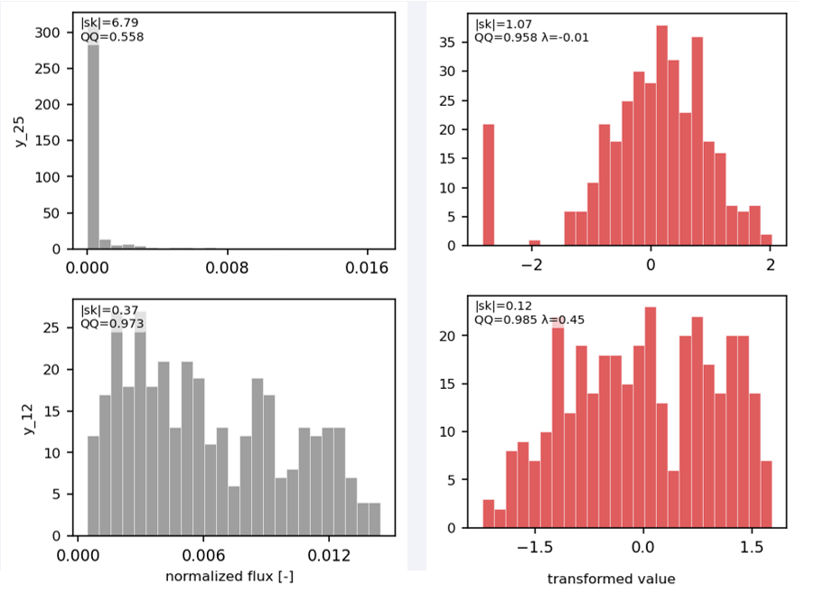

# Bayesian Calibration

## Overview

The Bayesian calibration step solves the inverse problem: given a target neutron spectrum \(\mathbf{y}^\text{obs}\), find the posterior over the shield parameters

\[
\pmb{\theta} = (x_1,\; t_1,\; \ldots,\; t_{N-1},\; L)
\]

that are consistent with that spectrum. \(x_1\) is the source-to-shield gap, \(t_k\) is the thickness of plate \(k\), and \(L\) is the square plate size. The material order is already fixed; one Sobol CSV is one stack.

A full OpenMC simulation inside an MCMC loop is too expensive. The calibration therefore has two stages:

1. **Surrogate.** A Gaussian process is trained on the Sobol dataset (see [`dataset_creation.py`](../scripts/dataset_creation.md)), one process per active energy bin, so that \(\pmb{\theta} \mapsto \mathbf{y}\) can be evaluated at negligible cost.
2. **Posterior sampling.** That surrogate replaces OpenMC inside a Bayesian model. The default sampler is sequential Monte Carlo, which on this posterior concentrates on one mode. NUTS is the alternative when separate chains should look for more than one geometry; it uses an analytic gradient of the posterior mean.

Fluxes in the CSV, and the target, are integral-normalised, so the posterior is over spectral shape. After sampling, the maximum-a-posteriori (MAP) geometry is checked with one OpenMC run.

```
Sobol CSV  ──►  GPR surrogate (one per active bin)
                    │
                    │  PyTensor op + analytic Matérn gradient
                    ▼
               PyMC model  (weighted χ² in the transformed flux)
                    │  SMC (default) or NUTS
                    ▼
               Posterior samples
                    │  min weighted χ² → MAP draw
                    ▼
               FW-CADIS OpenMC validation run  (thicknesses and L)
```

Knobs, cache, and output files are on the [script page](../scripts/calibration.md).

---

## Input parametrization

The Sobol dataset stores cumulative plate boundaries \((x_1, x_2, \ldots, x_N)\). They are ordered by construction, \(x_1 < x_2 < \cdots < x_N\), so a kernel distance on those columns mixes a gap with a sum of thicknesses.

The independent parameters are the ones the Sobol sampler actually drew:

\[
\pmb{\theta} = (x_1,\; t_1 = x_2 - x_1,\; \ldots,\; t_{N-1} = x_N - x_{N-1},\; L)
\]

A uniform prior on \(\pmb{\theta}\) then matches the training distribution. The cumulative boundaries are rebuilt when the MAP geometry is handed to OpenMC, and they are stored on the trace as deterministic nodes.

Inputs are MinMax-scaled to \([0, 1]^d\) with the training-split bounds before the kernel sees them to improve the model efficiency.

---

## Active bins

A target bin whose flux is exactly zero is dropped: no Gaussian process, no likelihood term, no Sobol index. Comparison plots leave a gap there. The same rule is used in [`analize_dataset.py`](../scripts/analize_dataset.md) and in the optimizer.

Weights from `WEIGHT_MODE` are computed on the full grid, zeroed on those bins, and then restricted to the bins that remain.

---

## Target transform

The surrogate is a Gaussian process, and the calibration likelihood is a normal \(\chi^2\). Both describe a bin well when the column they see is close to Gaussian: one peak, roughly symmetric, tails that fall off the way a bell curve does.

A normalised flux bin is often far from that shape. Over a Sobol sweep the same energy is near zero for many shields and bright for a few. On that raw column the constant mean sits on the spike, the bright samples look like outliers, and a residual of one standard deviation does not mean the same error near zero and out in the tail. That residual is the coordinate NUTS sees, so the column has to be made as Gaussian as a simple map allows before any length scale is fit.

A power transform is that map. It is monotone, with one exponent \(\lambda\) chosen by maximum likelihood so the transformed column is as Gaussian as that family can make it. scikit-learn documents the two families used here, Box–Cox and Yeo–Johnson, under [Mapping to a Gaussian distribution](https://scikit-learn.org/stable/modules/preprocessing.html#mapping-to-a-gaussian-distribution). The class is [`PowerTransformer`](https://scikit-learn.org/stable/modules/generated/sklearn.preprocessing.PowerTransformer.html): estimate \(\lambda\), then standardise to zero mean and unit variance. `calibration.py` estimates \(\lambda\) and standardises in the same step.

{: style="display:block;margin:0 auto;width:40rem;max-width:100%" }

*Left, grey: normalised flux in two energy bins, as the CSV stores it. Right, red: the same samples after a per-bin power transform. \(\lambda\) on a red panel is the exponent fitted for that bin. `|sk|` is the absolute skewness of the histogram; lower is closer to symmetric. `QQ` is the correlation of the sample with normal quantiles; closer to 1 is closer to Gaussian. The top bin is a spike on zero. The transform spreads the positive values into a rough bell and `QQ` rises, while every exact zero is still sent to one point, so a bar remains at the left edge. The bottom bin was already close to symmetric, so a milder \(\lambda\) is enough.*

A monotone map sends every exact zero to one value. When that bar is most of the bin, `|sk|` and `QQ` stay poor for every choice of \(f\).

### The coordinate the process is fit to

One map per bin, with \(f_b\), \(\mu_b\), and \(s_b\) taken from that bin's training column only:

\[
Z_b = \frac{f_b(Y_b) - \mu_b}{s_b}
\]

\(\mu_b\) and \(s_b\) are the mean and standard deviation of \(f_b(Y_b)\) on the training split. Dividing by \(s_b\) is the second half of the job. Flux bins span orders of magnitude, and a shared noise floor only makes sense once \(Z_b = 1\) means one standard deviation of bin \(b\), in every bin. If \(s_b\) is below \(10^{-12}\) (a bin with no spread), it is set to 1 so the division stays finite and \(Z_b \approx 0\). The inverse \(f_b^{-1}\) is applied exactly when a prediction is plotted in flux units, and when the posterior predictive band is built. The inverse is nonlinear, so a symmetric band in \(Z\) comes out asymmetric in flux, which is the shape a spike-plus-tail spectrum actually has.

Three maps are implemented. Which one to use is an empirical question; [`analize_dataset.py`](../scripts/analize_dataset.md) ranks these and several others by how close \(Z\) is to a normal. The script accepts the three names below.

| `Y_TRANSFORM` | \(f(Y)\) | When to use it |
|---|---|---|
| `boxcox` | Box–Cox power, \(\lambda\) fit on the positive training values | The column is strictly positive, and you want \(\lambda\) chosen for Gaussianity. Non-positive values are clipped to a small floor first, so an occasional Monte Carlo zero still has a finite transform. \(\lambda = 0\) is a logarithm; \(\lambda = 0.5\) is a square root. A bin with a nearly linear fit (\(\lambda\) above `LOG_OVERRIDE_LAMBDA`) whose target sits in the low tail of the training values is refitted with \(\lambda = 0\). Used on neutron-physics GPR outputs by [Lartaud et al. (2022)](#references). |
| `yeojohnson` | Yeo–Johnson power, \(\lambda\) fit on the whole training column | Same fit, and the formula is defined at zero, so Monte Carlo zeros are kept. \(\lambda = 1\) is the identity on \(y \ge 0\): an already bell-shaped bin can be left as it is. |
| `log_eps` | \(\log(Y + \varepsilon)\) | A logarithm with no free \(\lambda\). \(\varepsilon\) is set from the positive training values. The same compression in every bin, which is the right tool when the ranking says a log is enough. |

### Uncertainty propagation

Monte Carlo noise is heteroscedastic: the absolute error grows with the flux, so a bright sample and a near-zero sample do not share one \(\sigma\). The per-sample uncertainty \(\sigma_Y\) is pushed into \(Z\) by the delta method ([Oehlert, 1992](#references)):

\[
\sigma_Z = \sigma_Y \, \frac{|f'(Y)|}{s}
\]

For the three maps the derivative is \(y^{\lambda - 1}\) (Box–Cox, and \(1/y\) when \(\lambda = 0\)), \((y+1)^{\lambda-1}\) (Yeo–Johnson on \(y \ge 0\)), and \(1/(y+\varepsilon)\) (`log_eps`). This \(\sigma_Z\) is the heteroscedastic observation noise of the Gaussian process, so the surrogate treats Monte Carlo fluctuations as noise.

---

## GPR surrogate

One process is fitted per active bin:

\[
\hat Z_b(\pmb{\theta}) \approx Z_b(\pmb{\theta})
\]

Rows whose relative Monte Carlo uncertainty exceeds the configured cut are omitted from that bin, both when the process is fit and when the hold-out score is computed.

### Kernel

The covariance is an anisotropic Matérn kernel with smoothness \(\nu \in \{0.5, 1.5, 2.5\}\) and one length scale \(\ell_j\) per input, including \(L\). For these half-integer \(\nu\) the kernel and \(\partial k / \partial \theta_j\) have a closed form, and that derivative is the NUTS gradient.

### Trend

The mean is a constant. The NUTS surrogate reconstructs the posterior mean as \(\beta + \sum_i \gamma_i\, k(\pmb{\theta}, \mathbf{x}_i)\). The \(\gamma_i\) are one coefficient per training point, solved once at fit time from \(C\gamma = \mathbf{Z} - H\beta\).

### Hyperparameter optimisation

Length scales and amplitude are estimated by maximising the Gaussian-process log-likelihood. With trend basis \(H\) and

\[
C = K(\pmb{\ell}, \sigma_f) + \Sigma_\text{noise},
\qquad
\Sigma_\text{noise} = \mathrm{diag}(\sigma_{Z,1}^2, \ldots, \sigma_{Z,n}^2),
\]

\[
\log \mathcal{L}(\beta, \pmb{\ell}, \sigma_f)
  = -\frac12 (\mathbf{Z} - H\beta)^\top C^{-1} (\mathbf{Z} - H\beta)
    - \frac12 \log\det C
    - \frac{n}{2}\log 2\pi.
\]

The zero-mean, constant-variance case (\(H\beta = 0\), \(\Sigma_\text{noise} = \sigma_n^2 I\)) is [Rasmussen and Williams (2006)](#references), eq. 2.30. The expression above is the one [OpenTURNS](https://openturns.github.io/openturns/latest/theory/meta_modeling/gaussian_process_regression.html) maximises: the quadratic term is the residual of the trend, and `setNoise` puts the heteroscedastic variances on the diagonal of \(C\). The fitter then substitutes the generalised-least-squares \(\beta\), and, because each bin is a scalar output, the optimal amplitude. With those filled in, the search is only over the length scales.

The likelihood surface has many local maxima. A multi-start run keeps the start with the highest marginal likelihood. The first start is the configured initial length scale; further starts are a Latin-hypercube design, log-uniform between the length-scale bounds. If the Cholesky factor still fails, the noise is inflated and the fit is retried. A bin that never factors is replaced by its training mean in \(Z\), with a zero gradient, so sampling can proceed.

### Leave-one-out cross validation

Both scores use the same training rows in \(Z\), the ones that passed the uncertainty cut. They differ in whether a row is allowed to explain itself.

The training \(R^2\) predicts each row with a process fit on that row. A flexible kernel can sit close to those fluxes, so the score stays near 1 even when the process is copying the training rows, Monte Carlo noise included.

The leave-one-out \(R^2\) predicts each row as if it had been removed. It is computed from the inverse of the noisy kernel, without refitting ([Rasmussen and Williams, 2006](#references), eq. 5.12). Close values mean the training score is not just memorisation. A high training \(R^2\) and a much lower leave-one-out value mean the length scales are short and the process is fitting local wiggles.

Neither is the validation \(R^2\). That one uses hold-out rows that never entered the fit and that pass the same uncertainty cut. The leave-one-out score still uses length scales chosen with every training row present, so it is a little kinder than the held-out score.

---

## Sobol sensitivity indices

First-order and total-order Sobol indices are computed for each active bin by a Saltelli design on the trained metamodel ([Saltelli et al., 2008](#references)).

\(S_j^{(b)}\) is the fraction of the variance of bin \(b\), in the metamodel's output, attributed to input \(j\) alone. \(S_{T,j}^{(b)}\) adds every interaction that involves \(j\). The gap \(S_T - S_1\) is the interaction share. A gap near 0 means \(j\) acts on its own: its effect on that bin barely depends on the other inputs. A large gap means most of that influence appears only together with the other factors.

---

## Bayesian inference

### Prior

Each coordinate of \(\pmb{\theta}\) is uniform on the range of that coordinate in the training split:

\[
\theta_j = \theta_{j,\mathrm{lo}} + u_j \, (\theta_{j,\mathrm{hi}} - \theta_{j,\mathrm{lo}}),
\qquad u_j \sim \mathcal{U}(0, 1)
\]

The unit-interval latents are what the sampler steps in. The physical parameters, and the cumulative boundaries built by summing thicknesses, are deterministic transforms of those latents. The prior is the training box: the feasible region the surrogate was shown. A shorter interval, written into `prior_bounds` before sampling, drops every geometry outside it. That is how a run with several modes is brought back to one. The script page shows the assignment.

### Likelihood

The target is transformed with the same per-bin maps:

\[
z_b^\text{obs} = \frac{f_b(y_b^\text{obs}) - \mu_b}{s_b}
\]

`LIKELIHOOD_SIGMA_PCT` is a relative tolerance on the normalised flux, in percent. It is converted to a width in \(Z\) by the delta method, then floored:

\[
\sigma_{Z,b}
  = \max\!\left(
      \frac{p_b}{100}\, \big| y_b^\text{obs} \big| \, \frac{|f_b'(y_b^\text{obs})|}{s_b},\;
      \sigma_{Z,\min}
    \right)
\]

\(p_b\) may be a single percentage or one percentage per active bin.

Let \(w_b\) be the `WEIGHT_MODE` weight on active bin \(b\). Those weights start as shares that sum to 1, so with many bins a typical share is tiny and the whole \(\chi^2\) shrinks just because the grid is fine. Multiplying by the number of active bins keeps the same proportions and sets the average weight to 1: an average bin counts once, and a bin with twice the average dose counts twice. The widths and the weights are independent of \(\pmb{\theta}\), so the log-likelihood up to a constant is the weighted \(\chi^2\)

\[
\log p(\mathbf{y}^\text{obs} \mid \pmb{\theta})
  = -\frac12 \sum_b w_b
    \left(
      \frac{\hat Z_b(\pmb{\theta}) - z_b^\text{obs}}{\sigma_{Z,b}}
    \right)^2
\]

A smaller \(p_b\) forces bin \(b\) to be matched more tightly. A larger \(p_b\) widens the posterior and leaves more room for surrogate error.

### Sampling

The default sampler is sequential Monte Carlo (`pm.sample_smc`). On this posterior it concentrates on one mode, so the corner plot has a single peak and the chains agree. \(\hat R\) and the effective sample size are then the convergence checks of [Vehtari et al. (2021)](#references): \(\hat R < 1.01\), and a large bulk and tail effective sample size for each reported parameter (their rule of thumb is a few hundred). SMC generally reaches that with fewer draws than NUTS. `SAMPLING_DRAWS` is the particle count per chain. There is no warm-up count.

NUTS ([Hoffman and Gelman, 2014](#references); the geometric picture is [Betancourt, 2017](#references)) is the commented call. It is a local sampler, so separate chains can settle in different modes. That is the run to use when the question is whether more than one geometry fits the spectrum. Those modes disagree, \(\hat R\) rises, and a longer chain does not merge the peaks. Narrow `prior_bounds` to the mode you intend to keep, then sample again with SMC or with NUTS. NUTS uses `SAMPLING_TUNE` to adapt the step size and the mass matrix, and it generally needs more post-tuning draws before the same Vehtari diagnostics settle. Knobs and the two call sites are on the [script page](../scripts/calibration.md#sampling).

The surrogate inside the model is a PyTensor that:

- scales \(\pmb{\theta}\) with the training MinMax map,
- evaluates every active bin's Matérn posterior mean as \(\beta + \sum_i \gamma_i\, k(\pmb{\theta}, \mathbf{x}_i)\), with the \(\gamma_i\) stored at fit time,
- returns the Jacobian of that mean with respect to the physical parameters.

The Jacobian uses the closed form of the half-integer Matérn (\(\nu = 0.5\), \(1.5\), or \(2.5\)) and the chain rule through the scaler. Bins that fell back to a constant contribute a zero row.

### Posterior diagnostics

ArviZ reports, for the free parameters:

- a **summary table** — mean, standard deviation, \(\hat R\) (a converged run is near 1.01 or below), and effective sample size ([Vehtari et al., 2021](#references));
- a **trace plot** — chains should mix, without a drift or a stuck stretch;
- a **corner plot** — marginal and joint posterior densities.

The script also writes the Pearson correlation of the stacked draws, and a second corner plot with the source gap omitted (usually insensitive) so the thicknesses and \(L\) are easier to read.

---

## Best-sample selection and validation

### MAP configuration

The reported geometry is the posterior draw that minimises the same weighted \(\chi^2\) as the likelihood, in \(Z\):

\[
\chi^2(\pmb{\theta})
  = \sum_b w_b
    \left(
      \frac{\hat Z_b(\pmb{\theta}) - z_b^\text{obs}}{\sigma_{Z,b}}
    \right)^2
\]

The script also prints \(\chi^2 / N_\text{bins}\). A mean absolute log-relative error in flux units is printed for that draw as a direct reading of the spectrum error. Selection uses \(\chi^2(\pmb{\theta})\).

### Posterior predictive band

The band is wider than the MAP point. For each draw \(\pmb{\theta}_s\) and each bin, normal deviates are taken from \(\mathcal{N}(\hat Z_b(\pmb{\theta}_s),\, \sigma_{\mathrm{GP},b}^2(\pmb{\theta}_s))\) and passed through \(f_b^{-1}\). Percentiles of that mixture are the plotted band. The inverse is nonlinear, so the band in flux units is asymmetric. For Box–Cox with \(\lambda > 0\), the map only reaches \(y = 0\) at \(u = -1/\lambda\), and deviates below that point are the Gaussian tail spilling past zero flux; they are mapped to \(y = 0\). When \(\lambda\) is close to 1 the map is almost linear, so a wide bin can put its lower percentile exactly at zero, which a log axis draws as a band down to the bottom of the plot.

The law of total variance in \(Z\) splits the width into a parameter term, \(\mathrm{Var}[\hat Z_b(\pmb{\theta})]\), and a surrogate term, \(\mathbb{E}[\sigma_{\mathrm{GP},b}^2(\pmb{\theta})]\). Their ratio, per bin, says whether the band is dominated by the posterior or by the Gaussian process.

---

## References

- Lartaud et al. (2022). *Multi-output Gaussian processes for inverse uncertainty quantification in neutron noise analysis.* arXiv:2211.02465. <https://arxiv.org/abs/2211.02465>
- C. E. Rasmussen and C. K. I. Williams, *Gaussian Processes for Machine Learning*, MIT Press, 2006. [Online](http://www.gaussianprocess.org/gpml/)
- M. D. Hoffman and A. Gelman, "The No-U-Turn Sampler: Adaptively Setting Path Lengths in Hamiltonian Monte Carlo", *Journal of Machine Learning Research*, 15 (2014).
- M. Betancourt, "A Conceptual Introduction to Hamiltonian Monte Carlo", 2017. [arXiv:1701.02434](https://arxiv.org/abs/1701.02434)
- A. Vehtari, A. Gelman, D. Simpson, B. Carpenter, and P.-C. Bürkner, "Rank-normalization, folding, and localization: An improved \(\hat R\) for assessing convergence of MCMC", *Bayesian Analysis*, 16(2) (2021). <https://doi.org/10.1214/20-BA1221>
- A. Saltelli et al., *Global Sensitivity Analysis: The Primer*, Wiley, 2008.
- G. W. Oehlert, "A Note on the Delta Method", *The American Statistician*, 46(1), 27–29 (1992). <https://doi.org/10.1080/00031305.1992.10475842>
- OpenTURNS, "Gaussian process regression", theory guide. <https://openturns.github.io/openturns/latest/theory/meta_modeling/gaussian_process_regression.html>
- scikit-learn developers, "Mapping to a Gaussian distribution", preprocessing user guide. <https://scikit-learn.org/stable/modules/preprocessing.html#mapping-to-a-gaussian-distribution>
- PyMC, [docs.pymc.io](https://docs.pymc.io)
