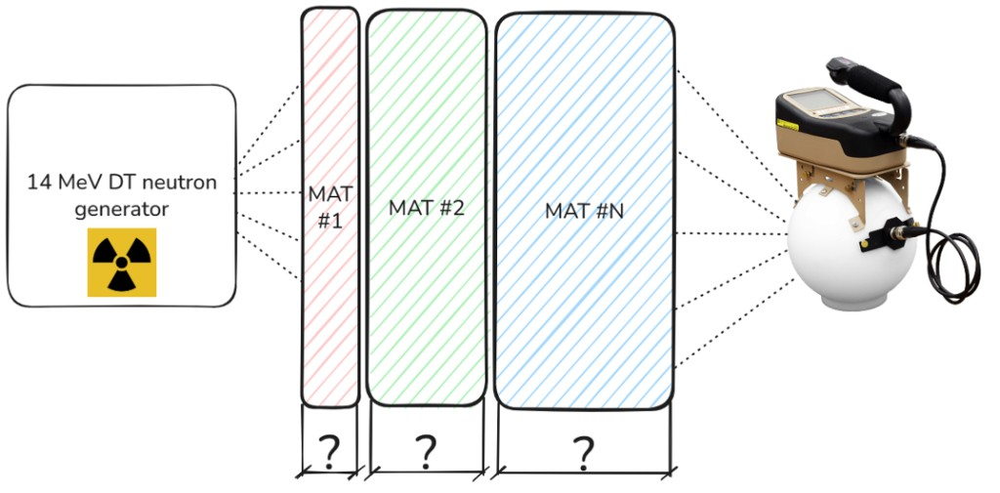

# Material Arrangement Optimizer

## The core idea

Given a neutron source and a target spectrum at a downstream detector, find a multi-layer shield, material sequence and a thickness per layer, that reproduces the shape of the target without being unnecessarily expensive. Those thicknesses are a starting point for the later [Bayesian calibration](bayesian_calibration.md); this step only has to land in a useful region of the design space.

*Source → plates (which materials, which thicknesses) → detector.*

The optimizer sees infinite slabs: no transverse leakage, no finite plate size. That is the [S_N operator](sn_transfer_operator.md) geometry. The full 3-D OpenMC model (finite plates, detector body) is built later, in [`base_plates.py`](../scripts/base_plates.md) and [`dataset_creation.py`](../scripts/dataset_creation.md).

The search is **multi-objective**. Optuna's TPE sampler is run as MOTPE ([Ozaki et al., 2022](#references)) and returns a Pareto front of non-dominated designs instead of a single scalar winner:

| Objective | Meaning | Direction |
|---|---|---|
| Spectral error | Detector-weighted log-RMSE between the normalised transmitted spectrum and the normalised target | minimise |
| Areal cost | Material cost of the plates, in USD per cm² of face area | minimise |

Both spectra are normalised so their bin fluxes sum to one. Intensity is not matched here, and the same convention is used downstream.

!!! info "This is an inverse problem"
    There is no guarantee that a stack reproducing the target exists, nor that the sampler finds a global optimum. The goal is a feasible front of good compromises, from which you pick a starting geometry.

Knobs, materials, and how to launch a run live on [`optimizer.py`](../scripts/optimizer.md). How a stack is transported lives on the [S_N Transfer Operator](sn_transfer_operator.md) page. This page is the search: the two objectives, how they are scaled, and how TPE explores the mixed discrete/continuous space.

---

## Why a search is necessary

Even before thicknesses, the number of material sequences with at most \(N_{\text{max layers}}\) layers drawn from \(m\) materials is

\[
\sum_{n=1}^{N_{\text{max layers}}} m^n
=
\frac{m\bigl(m^{N_{\text{max layers}}}-1\bigr)}{m-1}
\]

That already reaches \(10^{6}\)–\(10^{8}\) arrangements for a modest library, and each layer still has a continuous thickness. A Monte Carlo run per candidate is impossible. The \(S_N\) database is the surrogate: any stack is a product of precomputed operators, see [Layer composition](sn_transfer_operator.md#layer-composition).

---

## Evaluating a stack

A trial is a list of `(material, thickness)` layers. The optimizer does not rebuild tensors. It loads `opt_database/`, interpolates (or, if it must, extrapolates) each layer to the requested thickness, and applies \(\mathbf{m}_{k+1} = \mathbf{T}^{(k)}\mathbf{m}_{k}\). Source embedding, the \(\mu\)-sum, and the collapse onto the target grid are described under [Applying T to a source](sn_transfer_operator.md#applying-t-to-a-source). Interpolation and extrapolation formulae are under [Fractional thicknesses](sn_transfer_operator.md#fractional-thicknesses).

Two extra facts are specific to the search, not to the tensors themselves:

1. **On demand, not a precomputed grid.** Operators are built when a `(material, thickness)` pair is first seen and memorised. Thicknesses are snapped to `THICKNESS_STEP` so the search does not spend trials on stacks that differ by a fraction of a millimetre and are, for all practical purposes, the same design.
2. **Search stack ≠ physics stack.** Detector-embedding shells are appended as fixed trailing layers and do not count against the thickness budget or the cost ([Passive shells](../scripts/optimizer.md#passive-shells-in-the-optimizer)). If a trial picks `water`, 1 cm of `Al_6061` is inserted on each face of that layer representing the possible can containing the water. This affects physics, cost, and the total thickness check.

!!! warning "Stay inside the database thickness range"
    Extrapolation can violate positivity or the sub-stochastic column-sum bound even with the eigendecomposition safeguards in `optimizer.py`. I personally suggest covering the search bounds with `THICKNESSES` in [`transfer_matrix.py`](../scripts/transfer_matrix.md) so every trial interpolates.

---

## Spectral error

The first MOTPE objective is a weighted log-RMSE on the normalised shapes \(\hat{\phi}^{\text{out}}\) and \(\hat{\phi}^{\text{target}}\):

\[
\mathcal{L}(\text{stack})
=
\sqrt{
  \sum_{i} w_i
  \left[
    \log\!\bigl(\hat{\phi}^{\text{out}}_i + \varepsilon\bigr)
    -
    \log\!\bigl(\hat{\phi}^{\text{target}}_i + \varepsilon\bigr)
  \right]^2
},
\quad \varepsilon = \text{LOG_EPS}
\]

Neutron spectra span many orders of magnitude even after normalisation. A linear RMSE would be dominated by the few brightest bins; the log treats relative errors more evenly. \(\varepsilon\) is `LOG_EPS` from [`config.py`](../scripts/config.md#helpers) (default \(10^{-20}\)).

### Detector importance weighting

The weights \(w_i\) are not chosen in `optimizer.py`. They come from `WEIGHT_MODE` in [`config.py`](../scripts/config.md#per-bin-weighting) (`uniform`, `ICRP`, `response`, `dose`). They are normalised to \(\sum_i w_i = 1\); only ratios between bins matter. How `ICRP` and `dose` are built, and the plot used to pick one, is [`bin_weights.py`](../scripts/bin_weights.md).

!!! info "Bins with zero target flux are excluded, not floored to \(\varepsilon\)"
    A target bin can be exactly \(\phi^{\text{target}}_i = 0\) (groups outside the tabulated spectrum, or padding from rebinning). Those bins carry nothing to match. `target_nonzero_mask()` sets \(w_i = 0\) there in every mode and renormalises the rest, so the optimizer is not punished for transmitting flux into a bin that was simply never tabulated.

---

## Cost

The second objective is the areal material cost of the search stack. Prices are [`COST_PER_KG`](../scripts/config_materials.md#cost); densities come from the material library:

\[
\text{areal cost}
=
\sum_{\text{layers}}
\rho\,[\mathrm{g/cm}^3]
\cdot d\,[\mathrm{cm}]
\cdot \text{price}\,[\mathrm{USD/kg}]
\,/\, 1000
\]

in USD per cm$^2$ of plate face, so it does not depend on how large the plates are in the later 3-D OpenMC model. Detector-embedding shells are omitted: they are not a design choice, so they would only add a constant offset.

---

## Equal-weight MOTPE

Raw log-RMSE and USD/cm$^2$ live on different scales. MOTPE ranks trials by hypervolume, which is scale-dependent, so the two values returned to Optuna are dimensionless:

\[
f_\text{error} = \frac{\mathcal{L}}{\texttt{ERROR_REF}}
\qquad
f_\text{cost} = \frac{\text{areal cost}}{\texttt{COST_REF}}
\]

A design that is \(1\times\) `ERROR_REF` away in spectral error then costs the hypervolume exactly as much as one that is \(1\times\) `COST_REF` away in money. That is the equal-weighting. Tune the two reference values together so a typical good design sits near \(O(1)\) on both axes; raw (unscaled) error and cost are stored on every trial for plots and the terminal report.

A trial is **Pareto-optimal** if no other feasible trial is both cheaper and more accurate. The front is the lower-left staircase in the \((\text{cost},\,\mathcal{L})\) plane.

The equal-weight **recommendation** is the **knee**: the feasible Pareto point closest to the origin in the \((f_\text{error},\, f_\text{cost})\) plane,

\[
d = \sqrt{f_\text{error}^{2} + f_\text{cost}^{2}}
\]

The min-error endpoint is reported alongside it (best shape, usually more expensive). The min-cost endpoint is a near-empty stack with huge error and is not treated as a serious pick.

**Hypervolume** is how progress is measured (MOTPE has no single “best” scalar). In the same \((f_\text{error},\, f_\text{cost})\) plane, pick a deliberately bad corner — the **nadir** `HV_REF`. Everything you still care about should lie **below and to the left** of that corner (smaller error and smaller cost). The hypervolume is the **area** between the current Pareto staircase and that corner: the set of points the front already beats, and that still beat the nadir.

A trial that is worse than the nadir on either axis (its \(f_\text{error}\) or \(f_\text{cost}\) is not strictly smaller than the matching `HV_REF` entry) adds nothing to the area. Filling in already covered parts of the front does not grow it either; only a new non dominated point that cuts into the remaining rectangle does.

`HV_REF` is a yardstick, not an objective. In the code it is $(10,10)$: ten times `ERROR_REF` in log-RMSE and ten times `COST_REF` in USD/cm$^2$. Early stopping watches this area: if it has not grown for `PATIENCE` trials, that restart is done filling its front.

!!! tip "Keep the nadir well outside the designs you care about"
    If `HV_REF` is too tight, a useful but not tiny-\(f\) stack falls outside the box and is invisible to hypervolume, so stagnation can fire while the front is still moving. I personally suggest leaving it at many units unless the scaled front itself sits near the nadir.

=== "You care about the shape"

    Start from the **min-error** tag on the front, then check whether a nearby cheaper point is close enough in \(\mathcal{L}\).

=== "You want a balanced pick"

    Use the **equal-weight knee**. That is what the recommendation.

=== "The front looks wrong (everything piled in one corner)"

    `ERROR_REF` / `COST_REF` are off. If every “unit” of error is tiny compared to a unit of cost, MOTPE will chase cheap stacks. Rescale until both axes of a decent design are \(O(1)\).

---

## Constraints

`max_layers` and `max_thickness_per_layer` are hard bounds of the search space. The total thickness budget is not: layer thicknesses are sampled independently, so their sum can exceed `max_total_thickness`.

That overshoot is not added into \(\mathcal{L}\) or into the cost (that would warp the front). It is reported to TPE as a constraint,

\[
c = \max\bigl(0,\; d_\text{total} - d_\text{max}\bigr)
\]

with \(c > 0\) infeasible. Constrained TPE down-weights those trials instead of deleting them, so the sampler can still learn the structure of those stacks that broke the constraints.

`d_\text{total}` is the plates Optuna chose, plus the water cans if a layer is water. The detector's embedding shells are not added in: they are fixed hardware, not a design choice, so a thick detector moderator does not make an otherwise legal stack infeasible.

---

## Sampler

The sampler is [Optuna](https://optuna.org)'s **Tree-structured Parzen Estimator**. It fits well here because the space is mixed: an integer layer count, categorical materials, and stepped thicknesses. Background: [Akiba et al., 2019](#references) and [Watanabe, 2025](#references). Optuna ships [other samplers](https://optuna.readthedocs.io/en/stable/reference/samplers/) (NSGA-II, GP, CMA-ES, ...); using one of those here means a small code change in `optimizer.py` to construct the study with that sampler instead of TPE.

### Hyperparameters

Standard TPE models each parameter independently. Two flags from [Watanabe, 2025](#references) are on:

- **`multivariate=True`** — correlations between parameters (material A at 10 cm informing nearby thicknesses of A).
- **`group=True`** — 1-layer, 2-layer, … subspaces are modelled separately. A 3-layer trial does not train the 2-layer model.

Startup trials, \(\gamma\), EI candidates, and the prior / bandwidth floor follow that same paper. The numeric restart budget (`N_RESTARTS`, `PATIENCE`, …) is on the [script page](../scripts/optimizer.md#optimization-hyperparameters).

**Metric-TPE** ([Abe, Wang & Watanabe, 2025](#references)) replaces the usual “materials are unrelated symbols” kernel with a user metric. Similar operators in one trial become evidence for each other.

\[
\mathcal{M}(m_1, m_2)
=
\sum_{t \in \mathcal{G}}
\bigl\| \mathbf{T}_{m_1}(t) - \mathbf{T}_{m_2}(t) \bigr\|_{*},
\]

summed over the thicknesses that exist for every search material. The scale of \(\mathcal{M}\) does not matter: Optuna normalises by the per-basis maximum. The norm \(\|\cdot\|_{*}\) is `DISTANCE_NORM`:

| Option | Definition | Reads as |
|---|---|---|
| `frobenius` | \(\sqrt{\sum_{ij} A_{ij}^{2}}\) | Entry-wise RMS disagreement |
| `spectral` | \(\sigma_\text{max}(A)\) | Worst-case amplification over any input |
| `induced1` | \(\max_j \sum_i \lvert A_{ij}\rvert\) | Largest L1 discrepancy for a single input bin |

The distance uses the full \(S_N\) matrices \(\mathbf{T}\), not the energy spectra you would get by sending the source through each material and summing over \(\mu\). Only the first plate sees the source; a later plate sees a mixed beam that the plates in front already slowed and scattered. Two materials can look alike for that one source and still disagree on the states that actually appear in the middle of a stack. Comparing \(\mathbf{T}_{m_1}\) and \(\mathbf{T}_{m_2}\) as maps (an operator norm) is how similar they are for any incoming current, which is what stacking needs.

Summing over thickness avoids declaring two materials “the same” just because they agree at one \(t\).

### Multi-start and early stopping

A single TPE run can sit in a local basin. Independent restarts use different seeds. Each restart random-samples for `N_STARTUP_EACH` trials ([`n_startup_trials`](https://optuna.readthedocs.io/en/stable/reference/samplers/generated/optuna.samplers.TPESampler.html)), then TPE takes over. They run as separate processes.

Each restart stops when the Pareto hypervolume in the equal-weight plane has not improved for `PATIENCE` trials. That returns budget from a restart that has already filled its front. The combined front across restarts is what you actually pick from.

---

## References

- T. Akiba et al., "Optuna: A Next-generation Hyperparameter Optimization Framework", KDD 2019. [arXiv:1907.10902](https://arxiv.org/abs/1907.10902)
- Y. Ozaki, Y. Tanigaki, S. Watanabe, M. Nomura & M. Onishi, "Multiobjective Tree-Structured Parzen Estimator", *Journal of Artificial Intelligence Research* 73, 1209–1250 (2022). [doi:10.1613/jair.1.13188](https://doi.org/10.1613/jair.1.13188)
- S. Watanabe, "Tree-Structured Parzen Estimator: Understanding Its Algorithm Components and Their Roles for Better Empirical Performance", 2025. [arXiv:2304.11127](https://arxiv.org/abs/2304.11127)
- W. Abe, X. Wang & S. Watanabe, "Tree-Structured Parzen Estimator Can Solve Black-Box Combinatorial Optimization More Efficiently", 2025. [arXiv:2507.08053](https://arxiv.org/abs/2507.08053)
