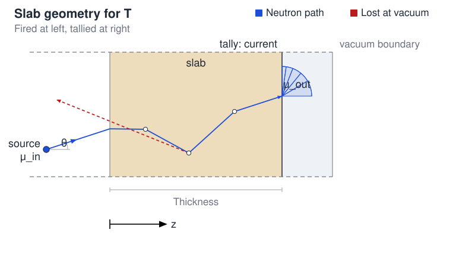

# S_N Transfer Operator

## The core idea

Consider a 1D slab shield of thickness \(d\) made of a single material.  
A **transfer operator** \(\mathbf{T}\) answers the question:

> *Given a neutron entering the left face with energy \(E_\text{in}\) and direction \(\mu_\text{in}\), what is the transmitted partial current leaving the right face with energy \(E_\text{out}\) and direction \(\mu_\text{out}\)?*

Here \(\mu = \cos\theta\), with \(\theta\) the polar angle from the slab normal (\(+z\)). Only the **forward hemisphere** \(\mu \in (0, 1]\) is tracked: \(\mu = 1\) is normal incidence, \(\mu \to 0\) is grazing. Backscattered neutrons that leave the entrance face are lost (vacuum boundary) and not tallied because they are assumed to negligible.

The operator is precomputed once per *(material, thickness)* and stored in `opt_database/`. Downstream, stacks of plates are evaluated by composing these operators — no new Monte Carlo during the optimization. See [`transfer_matrix.py`](../scripts/transfer_matrix.md) for the knobs; this page is the physics.

!!! info "Infinite 1-D slab"
    \(\mathbf{T}\) has no transverse leakage. Finite plate size \(L\) appears only in the later 3-D OpenMC model ([`base_plates.py`](../scripts/base_plates.md) / [`dataset_creation.py`](../scripts/dataset_creation.md)), not in the tensor.

---

## Discrete ordinates (S_N)

Rather than a continuous angular variable, \(\mu\) is discretised into \(N_\mu\) **half-range Gauss–Legendre ordinates** on \((0, 1]\):

\[
0 < \mu_1 < \mu_2 < \cdots < \mu_{N_\mu} < 1
\]

with associated quadrature weights \(w_k\) that would satisfy \(\sum_k w_k = 1\). Energy is grouped into \(N_E\) bins with edges \(\{E_0, E_1, \ldots, E_{N_E}\}\). The generation grid is not always the target grid, see [Source spectrum and the fine energy grid](#source-spectrum-and-the-fine-energy-grid).

\(N_\mu\) is `N_MU` in [`transfer_matrix.py`](../scripts/transfer_matrix.md#angular-quadrature). \(N_\mu\) forward ordinates on the transmission hemisphere are what a full-range \(S_{2N_\mu}\) set would put in \(\mu > 0\).

### Angular quadrature details

Half-range Gauss–Legendre: take the standard \(N_\mu\) nodes \(s_k\) on \([-1, 1]\) and remap

\[
\mu_k = \frac{s_k + 1}{2}
\]

The matching weights are halved so they still sum to 1, but the generator and the optimizer never use those wieghts. Each column of \(\mathbf{T}\) is a unit-strength beam at one node; the exit current is tallied in \(\mu\) bins, not reconstructed with a quadrature sum.

From the nodes the script builds:

| Object | Role |
|---|---|
| `MU_NODES` | Incident beam directions (one OpenMC run per node \(\times\) energy group) |
| `MU_EDGES` | \(N_\mu+1\) edges for `openmc.MuSurfaceFilter`: \(0\), midpoints between consecutive nodes, \(1\) — so each tally bin contains exactly one ordinate |

The default is \(N_\mu = 5\). Tally bins below are those `MU_EDGES` intervals:

| \(k\) | \(\mu_k\) | \(w_k\) | Tally bin \([\theta_\text{min}, \theta_\text{max}]\) |
|---|---|---|---|
| 0 | 0.0469 | 0.1185 | \([82.0°, 90°]\) |
| 1 | 0.2308 | 0.2393 | \([68.6°, 82.0°]\) |
| 2 | 0.5000 | 0.2844 | \([50.6°, 68.6°]\) |
| 3 | 0.7692 | 0.2393 | \([30.6°, 50.6°]\) |
| 4 | 0.9531 | 0.1185 | \([0°, 30.6°]\) — near-normal |

!!! danger "Changing `N_MU`"
    Nodes, edges, and the tensor shape all change. Delete `opt_database/sn_tensor_*.npy` and regenerate. I personally suggest leaving `N_MU` at 5 unless the extra \(N_\mu \times N_E\) columns are clearly worth it.

---

## The 4-D transfer tensor

The \(S_N\) transfer tensor is the 4-D array

\[
\mathbf{T}[\mu_\text{out},\, E_\text{out},\, \mu_\text{in},\, E_\text{in}]
\quad \text{shape: } N_\mu \times N_E \times N_\mu \times N_E
\]

Entry \((\mu_\text{out}, E_\text{out}, \mu_\text{in}, E_\text{in})\) is the transmitted partial current through the exit surface for a **unit-strength** monodirectional beam that enters at ordinate \(\mu_\text{in}\) with energy drawn uniformly in group \(E_\text{in}\).

To send a neutron state through a layer we need an ordinary matrix–vector product, so the 4-D tensor is reshaped into a square matrix of size \(N_\text{state} = N_\mu \times N_E\). The neutron state is a 1-D vector of the same length, laid out one angular bin after another, and inside each angle the energy groups in order:

\[
\mathbf{m}
=
\bigl[
\underbrace{m(\mu_0,E_0),\ldots,m(\mu_0,E_{N_E-1})}_{\text{angle }0},\;
\underbrace{m(\mu_1,E_0),\ldots,m(\mu_1,E_{N_E-1})}_{\text{angle }1},\;
\ldots
\bigr]
\]

The matrix \(\mathbf{T}_\text{2D}\) uses that same packing: each row is one outgoing \((\mu, E)\) pair, each column one incoming pair. Then \(\mathbf{m}_\text{out} = \mathbf{T}_\text{2D}\,\mathbf{m}_\text{in}\).

### Current instead of flux

Current per incident particle is always \(\leq 1\) in a purely absorbing/scattering slab, whereas a track-length flux tally can exceed 1 and would not be a transmission coefficient. Current also counts only neutrons that leave the material, so a neutron that backscatters and re-enters is not double-counted as transmitted.

Key properties:

Summing a column over \((\mu_\text{out}, E_\text{out})\) is the total forward transmission for that incident beam, \(\leq 1\) unless multiplication (e.g. \((n,2n)\)) dominates.

---

## Estimating T with OpenMC

Each column is one fixed-source run.

**Geometry.** Slab \(0 \le z \le d\), vacuum at \(z = 0\), transmission at the exit face \(z = d\), then a 1 cm void with vacuum at \(z = d+1\). The current is scored on the material–void interface.

**Source.** A point at the origin, direction \((\sqrt{1-\mu^2},\, 0,\, \mu)\) at `MU_NODES[μ_in]`, energy `Uniform` on the incident fine group, strength 1.

**Tally.** Neutron current on the exit face \(z = d\), binned in outgoing \(\mu\) (`MU_EDGES`) and outgoing energy (`ENERGY_EDGES`).

### Quality gate

The raw tally is not written as-is. For each exit bin the gate looks at the Monte Carlo relative error \(\sigma/\text{mean}\) against `SN_REL_ERR`, and at the mean against a noise floor `SN_THRESHOLD`:

| Mean | Rel. error OK? | Action |
|---|---|---|
| any | yes | **Keep** — including values below the noise floor. A well-resolved small current is signal. |
| \(\ge\) `SN_THRESHOLD` | no | **Fail the run** — double the particle count and rerun, up to `SN_PARTICLES_MAX`. |
| \(<\) `SN_THRESHOLD` | no | **Zero that bin**. This never triggers a rerun. |

If the particle cap is hit with a still-noisy large bin, the cleaned column is accepted anyway so the grid cannot stall forever.

!!! info "Why a floor at all"
    Tiny, poorly sampled tails would otherwise force every column up to the particle cap. The floor is a speed/accuracy trade, not a claim that sub-threshold physics is zero. Knobs live on the [script page](../scripts/transfer_matrix.md#quality-gate-per-incident-column).

Two files are written per pair:

| File | Contents |
|---|---|
| `sn_tensor_{mat}_{t}cm.npy` | Gate-cleaned mean of the tensor |
| `sn_tensor_{mat}_{t}cm_std.npy` | Monte Carlo standard deviation of the last run |

The optimizer loads only the mean.

---

## Layer composition

The reason for storing a full-rank \(S_N\) tensor is that multi-layer shields compose by matrix multiplication.

For an \(N\)-layer stack, with \(\mathbf{T}^{(i)}\) the flattened operator of layer \(i\):

\[
\mathbf{T}^\text{total} = \mathbf{T}^{(N)} \cdots \mathbf{T}^{(2)} \cdot \mathbf{T}^{(1)}
\]

Equivalently, the angle-resolved state \(\mathbf{m} \in \mathbb{R}^{N_\text{state}}\) is updated as \(\mathbf{m}_{k+1} = \mathbf{T}^{(k)}_\text{2D}\,\mathbf{m}_k\). That product replaces a full Monte Carlo run at every optimizer evaluation.

### Applying T to a source

The tensor itself does not contain the source intensities. At evaluation time ([`optimizer.py`](../scripts/optimizer.md)):

1. The source histogram from [`config.py`](../scripts/config.md) is overlap-rebinned onto the fine grid and normalised to a shape \(\hat{\phi}^\text{source}\) (sum 1).
2. That shape is embedded as a **near-normal pencil**: all energy groups sit in the last ordinate (`SOURCE_MU_INDEX = N_MU - 1`). Other \(\mu\) channels start at 0.
3. After the stack, the detector spectrum on the fine grid is the \(\mu\)-sum \( \phi_E = \sum_\mu m[\mu, E] \), then collapsed to the target grid ([below](#collapsing-back-to-the-target-grid)).

---

## Fractional thicknesses

The generator stores \(\mathbf{T}\) only on a discrete thickness grid (`THICKNESSES`). Interpolation and extrapolation are done later by the optimizer, on demand.

### Interpolation

For a requested thickness \(d\) between two database points \(d_1 < d < d_2\):

\[
T_{ij}(d) \approx \exp\!\left[(1-\alpha)\ln( \max(T_{ij}(d_1),\varepsilon)) + \alpha\ln( \max(T_{ij}(d_2),\varepsilon)\right)],
\quad
\alpha = \frac{d - d_1}{d_2 - d_1} \in (0,1)
\]

with \(\varepsilon = 10^{-30}\) inside the logarithm so \(\ln 0\) is avoided.

This is a geometric blend of the two bracketing tensors, motivated by Beer–Lambert: attenuation is exponential in thickness, so linear interpolation in log-space is the natural model.

### Extrapolation

Outside the grid, the nearest boundary operator is raised to a fractional power,

\[
\mathbf{T}(d) \approx \mathbf{T}(d_\text{bound})^{d / d_\text{bound}}
\]

via eigendecomposition with clamping of dead or unphysical eigenvalues. This should be avoided where possible, transfer tensors are not guaranteed to be positive definite. See [Evaluating a stack](optimization.md#evaluating-a-stack) for why the search bounds should stay inside the database range.

---

## Source spectrum and the fine energy grid

### The problem: source energy structure ≠ target energy structure

The target spectrum lives on a user-specified group grid (`TARGET_ENERGY_EDGES`).

To resolve the source without rewriting the target grid, the generator builds a fine grid that is the union of the two structures.

### The fine generation grid

Given `TARGET_ENERGY_EDGES` (\(N_\text{target}\) groups) and the source histogram edges from [`config.py`](../scripts/config.md):

\[
\mathcal{E}_\text{fine} = \mathcal{E}_\text{target} \cup \mathcal{E}_\text{source}.
\]

Only source edges that fall strictly inside the target range and do not already coincide with a target edge are added. Edges outside the simulated range are dropped. The result is the target grid with extra splits only where the source needs them.

The OpenMC tallies and the stored tensor both use this fine grid:

\[
\mathbf{T}_\text{fine}[\mu_\text{out},\, E_\text{out},\, \mu_\text{in},\, E_\text{in}]
\quad \text{shape: } N_\mu \times N_{E,\text{fine}} \times N_\mu \times N_{E,\text{fine}}
\]

### Source spectrum modes

Two kinds are available via `SOURCE_KIND` in [`config.py`](../scripts/config.md#source-spectrum). Both produce a histogram `(SOURCE_EDGES, SOURCE_VALUES)` of bin-integrated content.

| Kind | Description |
|---|---|
| `"gaussian"` | Peak discretised onto its own `n_bins` histogram (exact erf mass). |
| `"edges"` | User supplied piecewise-constant spectrum on an arbitrary grid. |

### Gaussian source

For `SOURCE_KIND = "gaussian"`, the Gaussian is not integrated bin-by-bin on the fine grid. It is discretised first onto `n_bins` equal-width bins covering \(\mu_0 \pm n_\sigma\sigma\) (clipped at \(E = 0\)):

\[
c_k = \frac{1}{2}\!\left[
  \operatorname{erf}\!\left(\frac{e_{k+1} - \mu_0}{\sqrt{2}\,\sigma}\right) -
  \operatorname{erf}\!\left(\frac{e_k - \mu_0}{\sqrt{2}\,\sigma}\right)
\right].
\]

Those \((e_k, c_k)\) become `SOURCE_EDGES` / `SOURCE_VALUES`. Their edges refine the target grid as above. At evaluation time the histogram is overlap-rebinned onto \(\mathcal{E}_\text{fine}\) (piecewise-constant density inside each source bin) and normalised.

\(\sum_k c_k\) equals the probability mass inside the truncation window, not necessarily 1 if the Gaussian is cut at \(E = 0\).

### Collapsing back to the target grid

After transport, the fine-grid output is collapsed to the target grid before comparison with the target spectrum. The collapse matrix \(\mathbf{C} \in \{0,1\}^{N_\text{target} \times N_{E,\text{fine}}}\) assigns each fine bin to the unique target bin whose edges contain its midpoint:

\[
\phi^\text{target}_i
=
\sum_{\substack{k:\,\mathrm{mid}(e^\text{fine}_k) \in [E_i, E_{i+1}]}}
\sum_{\mu}
m[\mu, k]
=
\bigl(\mathbf{C}\,\phi^\text{fine}\bigr)_i
\]
